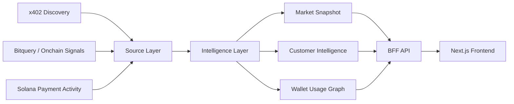

# 🌊 Flovia

> Turn agentic payment signals into market intelligence.

<p align="center">
  <strong>x402 × MPP × Solana × Customer Intelligence</strong>
</p>

<p align="center">
  
  
  
</p>

---

## 🚀 What is Flovia?

**Flovia** explores the emerging **agentic payments** layer: HTTP-native payment flows where agents, apps, and services can discover a paid resource, receive payment requirements, satisfy them programmatically, and continue without manual signup or API-key provisioning.

It combines x402 / MPP-style payment discovery, onchain activity signals, customer intelligence pipelines, a read-only demo API, and a Next.js frontend to reveal:

- which payment-gated APIs, tools, and services are appearing
- which wallets are economically active
- how usage clusters across apps and services
- where new customer opportunities may be forming
- how Solana-style high-frequency payment signals can shape market intelligence

The current implementation uses `contract / source / intelligence` layers across `packages/*`, consumed by `apps/cli`, `apps/bff`, and `apps/frontend`.

---

## 🧠 The thesis

The web is gaining a new economic layer.

Instead of relying only on manual subscriptions, signups, checkout flows, and long-lived API keys, software can increasingly:

- discover paid APIs, MCP tools, data feeds, and compute resources
- negotiate payment requirements through HTTP `402 Payment Required`
- pay per request, per result, per token, or through short-lived sessions
- compose paid services dynamically inside agent workflows
- leave machine-readable payment, receipt, and settlement traces
- generate wallet-, agent-, and service-level demand signals

This creates a new protocol and intelligence surface:

> **Agentic payments** — programmatic payment flows that let software agents and services exchange value inline with resource access.

Flovia does not treat MPP as “Machine Payable Products.” MPP means **Machine Payments Protocol**: an HTTP-oriented protocol for challenge / credential / receipt payment flows. Alongside x402, it points toward a world where payments become part of the request path itself.

Flovia explores the intelligence layer around that protocol-driven activity: what is being sold, who is paying, which rails are used, and where repeatable demand is forming.

---

## 🧭 Protocol context

| Area | Practical meaning for Flovia |
| --- | --- |
| **x402** | Uses HTTP `402 Payment Required` to let a server return payment requirements, receive a signed payment payload, and deliver the resource after verification / settlement. It is commonly associated with stablecoin settlement and facilitator services. |
| **MPP** | Machine Payments Protocol. Generalizes the HTTP payment challenge pattern with `WWW-Authenticate: Payment`, `Authorization: Payment`, and `Payment-Receipt` semantics, aiming to support multiple payment methods and session-style flows. |
| **Agentic payments** | The broader market pattern: agents, apps, and services pay for APIs, tools, content, data, or compute without traditional account setup, checkout, or long-lived API-key provisioning. |

Flovia’s current PoC is an intelligence system around these flows, not an implementation of every payment protocol. It uses discovery data, fixture-backed source clients, and onchain-style signals to model how machine-payment adoption could be observed and ranked.

---

## ✨ Demo flow



---

## ⚡ What Flovia reveals

| Signal | Insight |
| --- | --- |
| x402 / MPP-style discovery | Which payment-gated services exist? |
| Onchain payment activity | Which wallets are economically active? |
| Solana-style payment signals | Where high-frequency payment demand may emerge |
| Wallet co-usage | Which apps and services share customer clusters? |
| Customer intelligence | Who is likely to pay for what next? |

---

## 🟣 Why Solana signals?

Solana is a useful signal source for agentic-payment market intelligence because it emphasizes:

- low-cost payment events
- fast settlement
- wallet-native identity surfaces
- high-frequency usage patterns
- strong agent, DePIN, API-commerce, and payment experimentation ecosystems

Flovia currently treats Solana as a signal direction for onchain payment intelligence while keeping default verification deterministic and offline-first.

---

## 🏗️ Architecture

| Workspace                | Purpose                                                                                           |
| --------------------------| ---------------------------------------------------------------------------------------------------|
| `apps/cli/`              | CLI entrypoint, market snapshot / customer intelligence generation, fixture capture, reporting    |
| `apps/bff/`              | Read-only API for frontend demos; returns prepared fixtures / projections in a canonical envelope |
| `apps/frontend/`         | x402 co-usage discovery prototype UI built with Next.js 15 and React 19                           |
| `packages/contracts/`    | Shared Zod contracts for market intelligence and Phase B API schemas                              |
| `packages/sources/`      | Source clients and normalization for CDP Discovery and Bitquery                                   |
| `packages/intelligence/` | Join logic, ranking, customer intelligence, and projection helpers                                |

The CLI generates market snapshots and customer intelligence by combining CDP x402 Discovery and Bitquery. The BFF serves saved read models as a read-only API, and the frontend renders those projections as a Next.js UI.

---

## ⚡ Quick start

Requirements:

- Bun `>=1.3.13`
- Node.js `>=20` to run the frontend

```sh
bun install
cp -n .env.example .env
bun run verify
```

Environment variables are stored in the repository-root `.env` file. Use `.env.example` as a template. Live capture / snapshot / customer intelligence with Bitquery requires `BITQUERY_TOKEN`.

---

## 🧪 Common commands

Unless otherwise noted, run commands from the repository root.

```sh
bun run verify        # import boundary, typecheck, tests, offline verification
bun run test          # test suite
bun run typecheck     # TypeScript strict typecheck
bun run format        # format TypeScript / JSON with Biome
bun run format:check  # check formatting
```

Start the demo stack:

```sh
bun --filter bff start       # start read-only demo API (default: localhost:3001)
bun --filter frontend dev    # start frontend dev server (default: localhost:3000)
```

Or run BFF and frontend together:

```sh
docker compose up --build
```
