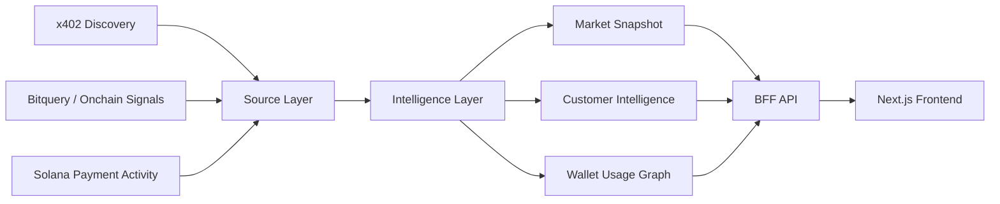

# 🌊 Flovia

> Turn x402 / MPP payments into decisions.

<p align="center">
  <strong>x402 × MPP × Solana × Customer Intelligence</strong>
</p>

<p align="center">
  
  
  
</p>

---

## 🚀 What is Flovia?

**Flovia** explores the emerging **Machine Payable Web** through market intelligence for machine-payable products and services.

It combines x402 payment discovery, onchain activity signals, customer intelligence pipelines, a read-only product API, and a Next.js demo frontend to reveal:

- what machine-payable services exist
- which wallets are economically active
- how usage clusters across apps and services
- where new customer opportunities may be forming
- how Solana-style high-frequency payment signals can shape market intelligence

The current implementation uses `contract / source / intelligence` layers across `packages/*`, consumed by `apps/cli`, `apps/bff`, and `apps/frontend`.

---

## 🧠 The thesis

The web is gaining a new economic layer.

Instead of relying only on manual subscriptions, signups, and checkout flows, software can increasingly:

- discover paid APIs
- pay per request
- compose services dynamically
- leave machine-readable payment traces
- generate wallet-level usage and demand signals

This creates a new category:

> **Machine Payable Products** — products and services that agents, apps, and APIs can discover, evaluate, and pay for programmatically.

Flovia explores the intelligence layer for that category.

---

## ✨ Demo flow



---

## ⚡ What Flovia reveals

| Signal | Insight |
| --- | --- |
| x402 service discovery | What machine-payable services exist? |
| Onchain payment activity | Which wallets are economically active? |
| Solana-style payment signals | Where high-frequency payment demand may emerge |
| Wallet co-usage | Which apps and services share customer clusters? |
| Customer intelligence | Who is likely to pay for what next? |

---

## 🟣 Why Solana signals?

Solana is a natural fit for machine-payable market intelligence because it emphasizes:

- low-cost payment events
- fast settlement
- wallet-native identity surfaces
- high-frequency usage patterns
- strong agent, DePIN, API-commerce, and payment experimentation ecosystems

Flovia currently treats Solana as a signal direction for onchain payment intelligence while keeping default verification deterministic and offline-first.

---

## 🏗️ Architecture

| Workspace | Purpose |
| --- | --- |
| `apps/cli/` | CLI entrypoint, market snapshot / customer intelligence generation, fixture capture, reporting |
| `apps/bff/` | Read-only product API for frontend demos; returns prepared fixtures / projections in a canonical envelope |
| `apps/frontend/` | x402 co-usage discovery prototype UI built with Next.js 15 and React 19 |
| `packages/contracts/` | Shared Zod contracts for market intelligence and Phase B product API schemas |
| `packages/sources/` | Source clients and normalization for CDP Discovery and Bitquery |
| `packages/intelligence/` | Join logic, ranking, customer intelligence, and projection helpers |

The CLI generates market snapshots and customer intelligence by combining CDP x402 Discovery and Bitquery. The BFF serves saved read models as a read-only product API, and the frontend renders those projections as a Next.js UI.

---

## ⚡ Quick start

Requirements:

- Bun `>=1.3.13`
- Node.js `>=20` to run the frontend

```sh
bun install
cp -n .env.example .env
bun run verify
```

Environment variables are stored in the repository-root `.env` file. Use `.env.example` as a template. Live capture / snapshot / customer intelligence with Bitquery requires `BITQUERY_TOKEN`.

---

## 🧪 Common commands

Unless otherwise noted, run commands from the repository root.

```sh
bun run verify        # import boundary, typecheck, tests, offline verification
bun run test          # test suite
bun run typecheck     # TypeScript strict typecheck
bun run format        # format TypeScript / JSON with Biome
bun run format:check  # check formatting
```

Start the demo stack:

```sh
bun --filter bff start       # start read-only product API (default: localhost:3001)
bun --filter frontend dev    # start frontend dev server (default: localhost:3000)
```

Or run BFF and frontend together:

```sh
docker compose up --build
```
