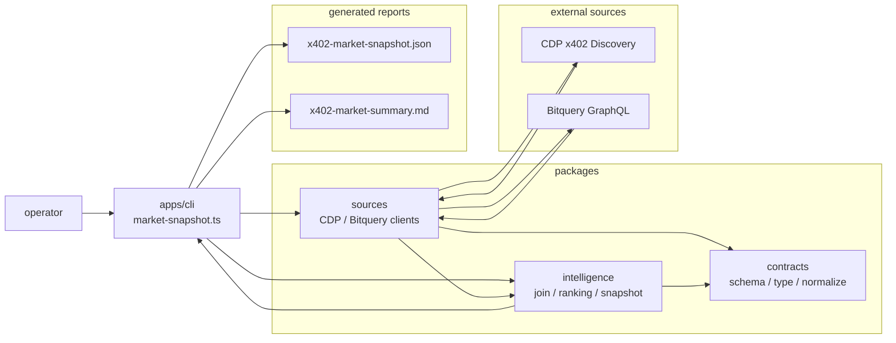
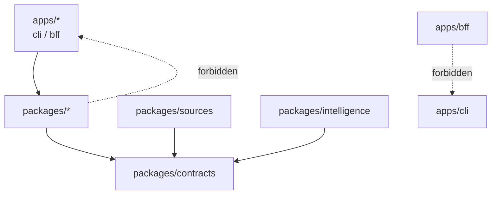

# CLI scripts

This directory stores scripts used by the CLI from `apps/cli`.

## Current main path

- `analytics/market-snapshot.ts`
  - Fetches HTTP resources and payment options from CDP x402 Discovery
  - Scopes by the given `network` / `asset`
  - Queries Bitquery for scoped `payTo` values
  - Joins CDP metadata with Bitquery payment activity
  - Writes JSON / Markdown market snapshot reports
- `analytics/capture-coingecko-transactions.ts`
  - Live captures CoinGecko Base USDC `payTo` Bitquery transfer list
  - Generates `apps/bff/fixtures/phase-a/coingecko-transactions.json`
  - Assigns deterministic mock endpoint attribution for all `txHash` values and generates `apps/bff/fixtures/phase-b/mock-attribution.json`
  - Validates with fixture schema in `packages/contracts` before and after generation
- `analytics/customer-intelligence.ts`
  - Fetches Base USDC outgoing transfers from Bitquery by customer address
  - Matches `payTo` with CDP Discovery resources / payment options
  - Fetches wallet-wide portfolio / DeFi positions from Zerion Portfolio API only when `--portfolio-source zerion` is specified
  - Generates insights with payTo activity / x402 service candidates / provenance in `packages/intelligence`
  - Writes read models equivalent to `apps/bff/fixtures/phase-b/customer-intelligence/*.json`
  - If portfolio / DeFi source is not configured or unavailable, represents it as `unavailableReason`; BFF request path does not call live sources

The legacy self-implemented acquisition / probe / onchain pipeline
is stored on the `v0-self-implemented-x402` branch. It is intentionally not included in this branch.

## How to run

`market:snapshot` is defined as a script in `apps/cli/package.json`. Run it from `apps/cli`, not the repository root.

```sh
cd apps/cli
bun run market:snapshot -- --limit 50 --network base --asset usdc
```

When running from the repository root, use `--cwd`.

```sh
bun --cwd apps/cli market:snapshot -- --limit 50 --network base --asset usdc
```

Because Bitquery is used, `BITQUERY_TOKEN` is typically required.

To regenerate CoinGecko transaction facts and Phase B mock attribution fixtures, run:

```sh
bun --cwd apps/cli coingecko:transactions -- \
  --from 2026-01-01T00:00:00Z \
  --to 2026-04-29T23:59:59Z \
  --limit 5000 \
  --page-size 100
```

This script loads `../../.env` and `apps/cli/.env` through dotenvx. It uses live Bitquery, so it is not included in normal `bun run verify` runs.

To generate the customer intelligence read model, run:

```sh
bun --cwd apps/cli customer:intelligence -- \
  --address 0xac5a07c44a4f971667b3df4b6551fb6991b2142d \
  --network base \
  --asset USDC \
  --from 2026-01-01T00:00:00Z \
  --to 2026-04-29T23:59:59Z \
  --out ../bff/fixtures/phase-b/customer-intelligence/0xac5a07c44a4f971667b3df4b6551fb6991b2142d.json
```

This command also uses live Bitquery / CDP Discovery, so it is not included in normal `bun run verify`. Output JSON is validated with `CustomerIntelligenceFixture` schema; BFF returns only stored read models.

Enable Zerion portfolio / DeFi context explicitly.

```sh
bun --cwd apps/cli customer:intelligence -- \
  --address 0xac5a07c44a4f971667b3df4b6551fb6991b2142d \
  --network base \
  --asset USDC \
  --from 2026-01-01T00:00:00Z \
  --to 2026-04-29T23:59:59Z \
  --portfolio-source zerion \
  --out ../bff/fixtures/phase-b/customer-intelligence/0xac5a07c44a4f971667b3df4b6551fb6991b2142d.json
```

`ZERION_API_KEY` is required only when `--portfolio-source zerion` is specified. When not specified, the portfolio source is treated as `unavailable`, so offline verification and normal `bun run verify` do not require Zerion credentials. Zerion response is normalized into repository-owned DTOs before persistence, and raw response, API key, Authorization header, and request metadata are not included in product payloads / fixtures.

## Architecture

The CLI is kept as an orchestration entry point, with fetch / normalization / analysis delegated to `packages/*`.



Dependency direction is as follows.



## Output

By default, these files are written.

- `apps/cli/reports/x402-market-snapshot.json`
- `apps/cli/reports/x402-market-summary.md`

`reports/` contains generated artifacts and can be regenerated as needed.

Default output for `coingecko:transactions` is:

- `apps/bff/fixtures/phase-a/coingecko-transactions.json`
- `apps/bff/fixtures/phase-b/mock-attribution.json`

## Fetch flow

Acquisition uses a **two-stage CDP Discovery-first fetch + join**:

```text
1. Fetch resource / payment option list from CDP x402 Discovery
2. Filter payment options by network / asset scope
3. Deduplicate scoped network + asset + payTo tuples
4. Aggregate Base USDC transfers to payTo with Bitquery GraphQL
5. Join activity into CDP metadata using network + asset + payTo as join key
6. Generate snapshot with active flags, ranking, and discrepancy checks
```

From CDP Discovery, it fetches:

- resource URL
- provider / service
- payment option
  - scheme
  - network
  - asset
  - amount
  - payTo
- provenance / quality / metadata

From Bitquery, it fetches:

- `transactionCount`
- `uniqueSenderCount`
- `totalVolumeAtomic`
- `latestTransfer`

Raw data and aggregation are performed by Bitquery itself. This repository converts the response into a normalized `BitqueryAggregate` DTO and fills missing `payTo` values with zero activity.

## Execution sequence


## Relation between `payment option` and `payTo`

In CDP Discovery, payment options are listed per resource. However, the actual recipient
`payTo` can be shared across multiple resources.

Example:

```text
/x402/token-balances       base USDC payTo=0xabc
/x402/portfolio-totals     base USDC payTo=0xabc
/x402/account-identity     base USDC payTo=0xabc
```

In this case, there are 3 payment options but only 1 `payTo` queried on Bitquery.
So a result like "54 scoped payment options / 17 unique payTo" means there are 54 matching payment endpoints for Base USDC, aggregated to 17 receiver addresses.

## Insights from the report

The main things to read from a generated report are:

- number of Discovery resources that fall into the target scope
- number of scoped payment options with observed transfers
- `transaction count / unique sender / volume` per `payTo`
- active resource / inactive resource
- skew in top resources and top recipients
- gap between CDP quality metrics and Bitquery activity metrics

However, current resource ranking requires attention around shared `payTo`.
Bitquery observes total transfers **to `payTo`**, not **payment counts per resource URL**.
When multiple endpoints share the same `payTo`, the same aggregate is attached to multiple resources.

A closer-to-observation view is therefore separated as:

- `payTo` ranking: recipient-level activity closest to Bitquery measurements
- resource listing: endpoints listed by CDP and their payment activity
- shared payTo group: groups of endpoints sharing the same `payTo`

## Endpoints not listed in CDP Discovery

Because this script is Discovery-first, x402 endpoints not listed in CDP Discovery are not included automatically.

If you need to add one, add a source client in `packages/sources` rather than implementing it directly in `apps/cli`.

Examples:

- known endpoint list source
- third-party registry source
- sitemap / GitHub index source
- live probe source

Additional sources should be normalized into a common shape equivalent to `CdpResource` in `contracts`, then passed to `packages/intelligence`. Ranking and scoring are not done in `packages/sources`.

## Current limitations

- Bitquery activity is currently Base USDC only
- exact utilization breakdown at the resource URL level is not known
- it does not prove that a transfer was fully x402-mediated
- endpoints not listed in CDP Discovery are out of scope unless another source is added
- uses live APIs, so these commands are not included in normal `bun run verify`
