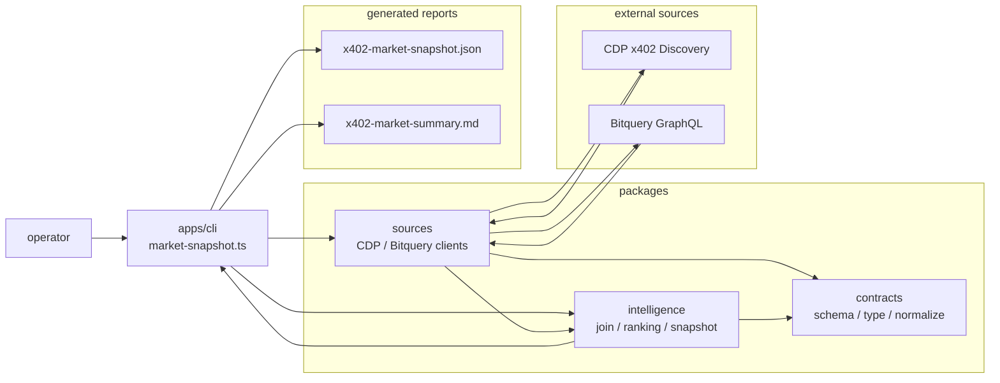
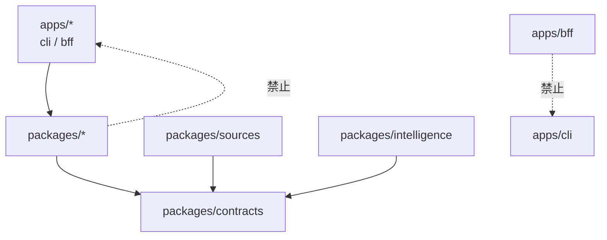
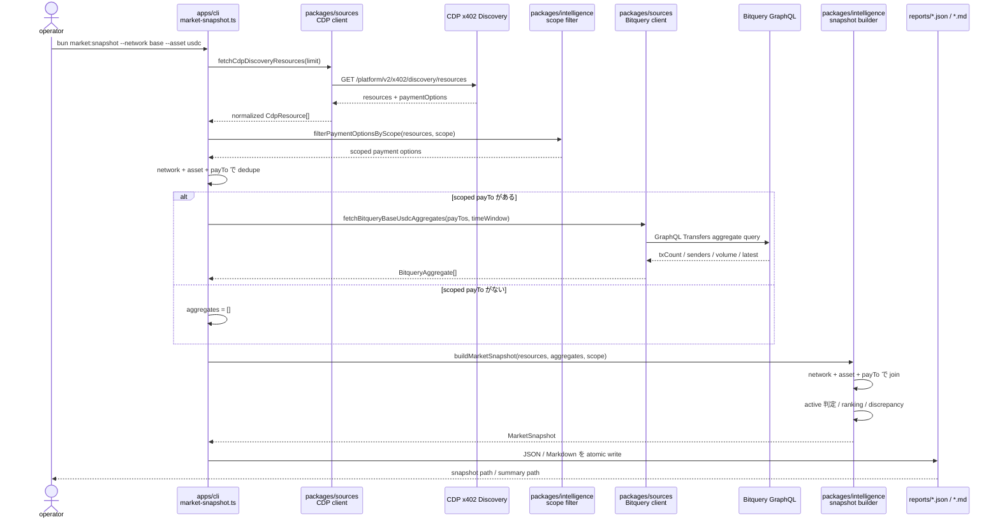

# CLI scripts

このディレクトリには、`apps/cli` から実行する CLI 用スクリプトを置きます。

## 現在の主経路

- `analytics/market-snapshot.ts`
  - CDP x402 Discovery から HTTP resource と payment option を取得する
  - 指定された `network` / `asset` で scope を絞る
  - scope 対象の `payTo` を Bitquery に問い合わせる
  - CDP metadata と Bitquery payment activity を結合する
  - JSON / Markdown の market snapshot report を書き出す
- `analytics/capture-coingecko-transactions.ts`
  - CoinGecko Base USDC `payTo` の Bitquery transfer list を live capture する
  - `apps/bff/fixtures/phase-a/coingecko-transactions.json` を生成する
  - 全 `txHash` に deterministic mock endpoint attribution を割り当て、`apps/bff/fixtures/phase-b/mock-attribution.json` を生成する
  - 生成前後に `packages/contracts` の fixture schema で検証する

旧 self-implemented acquisition / probe / onchain pipeline は
`v0-self-implemented-x402` branch に保存済みです。この branch には意図的に含めていません。

## 実行方法

`market:snapshot` は `apps/cli/package.json` の script です。リポジトリルートではなく
`apps/cli` から実行します。

```sh
cd apps/cli
bun run market:snapshot -- --limit 50 --network base --asset usdc
```

リポジトリルートから実行する場合は `--cwd` を使います。

```sh
bun --cwd apps/cli market:snapshot -- --limit 50 --network base --asset usdc
```

Bitquery を使うため、通常は `BITQUERY_TOKEN` が必要です。

CoinGecko transaction facts と Phase B mock attribution fixture を再生成する場合は次を実行します。

```sh
bun --cwd apps/cli coingecko:transactions -- \
  --from 2026-01-01T00:00:00Z \
  --to 2026-04-29T23:59:59Z \
  --limit 5000 \
  --page-size 100
```

この script は `../../.env` と `apps/cli/.env` を dotenvx 経由で読み込みます。live Bitquery を使うため、通常の `bun run verify` には含めません。

## アーキテクチャ

CLI は実行入口に徹し、取得・正規化・分析は `packages/*` に寄せます。



依存方向は次の通りです。



## 出力

デフォルトでは次のファイルを書き出します。

- `apps/cli/reports/x402-market-snapshot.json`
- `apps/cli/reports/x402-market-summary.md`

`reports/` は生成物なので、必要に応じて再生成します。

`coingecko:transactions` のデフォルト出力は次の通りです。

- `apps/bff/fixtures/phase-a/coingecko-transactions.json`
- `apps/bff/fixtures/phase-b/mock-attribution.json`

## 取得方法

取得は **CDP Discovery を入口にした 2 段階取得 + join** です。

```text
1. CDP x402 Discovery から resource / payment option 一覧を取得
2. payment option を network / asset で scope filtering
3. scope 対象の network + asset + payTo を重複排除
4. Bitquery GraphQL で payTo 宛の Base USDC transfer を集計
5. network + asset + payTo を join key として CDP metadata に activity を結合
6. active 判定、ranking、discrepancy を付けて snapshot を生成
```

CDP Discovery から取得するもの:

- resource URL
- provider / service
- payment option
  - scheme
  - network
  - asset
  - amount
  - payTo
- provenance / quality / metadata

Bitquery から取得するもの:

- `transactionCount`
- `uniqueSenderCount`
- `totalVolumeAtomic`
- `latestTransfer`

Bitquery の元データと集計処理は Bitquery 側です。この repo では、その応答を
`BitqueryAggregate` という正規化済み DTO に変換し、返ってこなかった `payTo` は
zero activity として埋めます。

## 実行シーケンス



## `payment option` と `payTo` の関係

CDP Discovery では resource ごとに payment option が並びます。一方、実際の受取先
`payTo` は複数 resource で共有されることがあります。

例:

```text
/x402/token-balances       base USDC payTo=0xabc
/x402/portfolio-totals     base USDC payTo=0xabc
/x402/account-identity     base USDC payTo=0xabc
```

この場合、payment option は3個ですが、Bitquery に問い合わせる `payTo` は1個です。
そのため、例えば「54 scoped payment options / 17 unique payTo」という結果は、
Base USDC の支払い口は54個あるが、受取アドレスは17個に集約されている、という意味です。

## report から読める insight

生成された report からは主に次を読みます。

- Discovery 掲載 resource のうち、指定 scope に入るものの数
- scope 対象 payment option のうち、実際に transfer が観測されたものの数
- `payTo` 単位の transaction count / unique sender / volume
- active resource / inactive resource
- 上位 resource と上位受取先の偏り
- CDP quality metrics と Bitquery activity metrics の乖離

ただし、現状の resource ranking は `payTo` 共有に注意が必要です。
Bitquery が見ているのは **resource URL ごとの支払い回数ではなく、payTo 宛の transfer 総数** です。
同じ `payTo` を複数 endpoint が共有している場合、同じ aggregate が複数 resource に紐づきます。

そのため、より実測に近い見方は次の分離です。

- `payTo` ranking: Bitquery の実測に近い受取先単位の活動
- resource listing: CDP に掲載された endpoint と、その支払い口の活動
- shared payTo group: 同じ `payTo` を共有する endpoint 群

## CDP Discovery に載っていない endpoint

この script は CDP Discovery を入口にするため、CDP Discovery に載っていない x402 endpoint は
自動では対象になりません。

追加したい場合は、`apps/cli` に直接実装せず、`packages/sources` に source client を増やします。

例:

- known endpoint list source
- third-party registry source
- sitemap / GitHub index source
- live probe source

追加 source も最終的には `contracts` の `CdpResource` 相当の共通形に正規化して、
`packages/intelligence` に渡します。ranking や scoring は `packages/sources` では行いません。

## 現状の制約

- Bitquery activity 取得は現状 Base USDC 専用
- resource URL 単位の厳密な利用内訳は分からない
- transfer が完全に x402 経由だったことまでは証明しない
- CDP Discovery に未掲載の endpoint は別 source を追加しない限り対象外
- live API を使うため、通常の `bun run verify` には含めない
