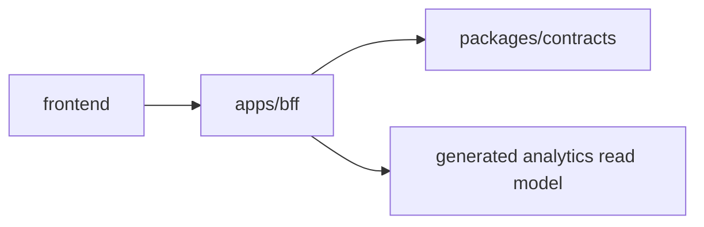

# BFF Frontend Onboarding Guide

This document is a guide for frontend engineers to run `apps/bff` in development
and use it from screen implementation.

## Role of BFF

`apps/bff` is a read-only product API boundary for frontend.

The frontend treats the BFF endpoint and API contracts defined in
`packages/contracts` as a boundary, and does not depend directly on chain,
SDK, DB, or fixtures.



## Prerequisites

- `bun install` already run at repo root
- BFF is started using Bun
- Regular frontend development should not assume fan-out requests to live RPC or
  external services

Main related locations:

```txt
apps/bff/README.md
apps/bff/src/http.ts
apps/bff/src/data/
apps/bff/fixtures/generated/analytics.json
packages/contracts
docs/phase-b/api-contract.md
```

## Data source

BFF resolves analytics data in this order:

1. `BFF_ANALYTICS_READ_MODEL_PATH`, when set and the file exists
2. `apps/bff/fixtures/generated/analytics.json`, when present
3. built-in Phase B demo fixtures as fallback

The generated analytics JSON is the product-facing read model. It may be
generated from `analytics.sqlite`, but production BFF does not need SQLite or
live source credentials.

```bash
# Optional explicit override
BFF_ANALYTICS_READ_MODEL_PATH=fixtures/generated/analytics.json bun --filter bff start
```

The generated JSON can include:

```txt
serviceSummary
serviceComparison
serviceQuadrants
customers
walletUsageGraph
profilesByAddress
intelligenceByAddress
```

## How to start

From repository root:

```bash
bun --filter bff start
```

From within `apps/bff`:

```bash
bun run start
```

Default port is `3001`.

```txt
http://localhost:3001
```

To change the port, set `PORT`:

```bash
PORT=3002 bun --filter bff start
```

## Frontend configuration

Manage the BFF base URL with environment variables in the frontend app.

Next.js example:

```env
BFF_URL=http://localhost:3001
NEXT_PUBLIC_BFF_URL=/api
```

API client example:

```ts
const BFF_BASE_URL = process.env.BFF_URL ?? "http://localhost:3001";

export async function fetchCustomers() {
  const response = await fetch(`${BFF_BASE_URL}/customers`);

  if (!response.ok) {
    throw new Error(`failed to fetch customers: ${response.status}`);
  }

  return response.json();
}
```

## Available endpoints

### Health check

```http
GET /health
```

Health check endpoint to verify BFF is running.

### Customer list

```http
GET /customers
```

Returns customer list and is used for the customers list screen and dashboard entry.

### Customer profile

```http
GET /customers/:address/profile
```

Returns customer profile bound to wallet address. Address normalization is performed
on BFF side.

### Customer intelligence

```http
GET /customers/:address/intelligence
```

Returns wallet-level customer intelligence for the sampled address, including
x402 payTo activities, matched service candidates, portfolio coverage, and
derived insights. Address normalization is performed on BFF side.

### Wallet usage graph

```http
GET /wallet-usage-graph
```

Returns a graph payload showing wallet-to-provider usage relationships.

### CoinGecko service summary

```http
GET /analytics/services/coingecko/summary
```

Returns summary analytics for the CoinGecko x402 service, including user count,
transaction count, average transactions per user, repeat-user rate, top
endpoints, and comparison metadata.

This endpoint is intentionally CoinGecko-specific for the current PoC. Other
services are exposed through the comparison and quadrant endpoints below rather
than through per-service summary endpoints.

### Service comparison

```http
GET /analytics/services/comparison
```

Returns service-level comparison analytics across available x402 services. This
payload is intended for comparison tables, rankings, and peer benchmarking.
The payload includes CoinGecko and peer services from the generated analytics
read model.

### Service quadrants

```http
GET /analytics/services/quadrants
```

Returns quadrant-ready analytics points for visualizing services by average
transactions per user and endpoint diversity.
The payload includes CoinGecko and peer services from the generated analytics
read model.

## API contract

BFF product endpoints follow the API contract defined in
`packages/contracts`.

Frontend should treat BFF endpoint responses and contract as boundaries, and should
not depend directly on fixture structure under `apps/bff/src/data/*`.

Frontend should also not read `analytics.sqlite` directly. SQLite is an offline
analytics/capture artifact; BFF exposes only generated read models.

See `docs/phase-b/api-contract.md` for detailed DTO structures.

## Read-only constraints

BFF product endpoints accept only GET.

- `GET` returns JSON response on success
- non-GET methods return `405 method_not_allowed`
- unknown routes return `404 not_found`

Frontend must not call POST, PUT, PATCH, or DELETE.

## Development notes

- Frontend depends on BFF endpoints and API contract.
- Frontend does not depend directly on internals under
  `apps/bff/src/data/`.
- Frontend does not depend directly on `analytics.sqlite` or generated raw
  artifacts under `apps/cli/data/analytics/`.
- If `apps/bff/fixtures/generated/analytics.json` exists, BFF uses it by
  default. Delete or rename it to test built-in fixture fallback.
- Before changing payload shape, confirm `packages/contracts` and
  `docs/phase-b/api-contract.md` first.
- Do not include live RPC or external service checks in normal `verify` flow.
- On frontend screens, check `response.ok`, and handle `404 / 405 / network`
  errors.

## Verification

Run full verification from repository root.

```bash
bun run verify
```

To verify only BFF:

```bash
bun --filter bff verify
```

To run tests only:

```bash
bun --filter bff test
```

## Common issues

### `fetch failed` or connection error

- Confirm BFF is running.
- Confirm frontend base URL points to `http://localhost:3001`.
- If `PORT` is changed, align frontend environment variable as well.
- In Docker Compose, frontend uses `BFF_URL=http://bff:3001` internally.

### `404 not_found`

- Confirm endpoint path is correct.
- For customer profile, confirm the address exists in demo data.
- For generated analytics data, confirm the address exists in
  `customers` / `profilesByAddress` / `intelligenceByAddress` in the generated
  analytics JSON.

### Generated analytics not reflected

- Confirm `apps/bff/fixtures/generated/analytics.json` exists in the BFF runtime.
- If using an override, confirm `BFF_ANALYTICS_READ_MODEL_PATH` points to an
  existing JSON file from the BFF process working directory.
- Restart BFF after regenerating the JSON; the generated read model is loaded at
  process startup.

### `405 method_not_allowed`

- Confirm you are not calling non-GET methods.

## Related documents

- `apps/bff/README.md`
- `docs/phase-b/api-contract.md`
- `packages/contracts`
