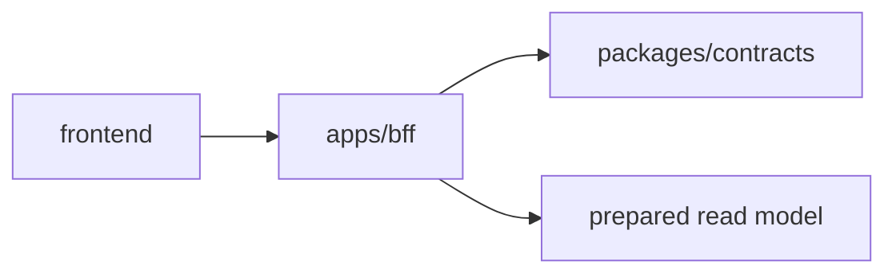

# BFF frontend 導入ガイド

このドキュメントは、frontend 技術者が `apps/bff` を開発環境へ導入し、画面実装から利用するためのガイドです。

## BFF の役割

`apps/bff` は frontend 向けの read-only product API 境界です。

frontend は chain、SDK、DB、fixture に直接依存せず、BFF の endpoint と `packages/contracts` に定義された API contract を境界として扱います。



## 前提

- root で `bun install` 済みであること
- BFF は Bun で起動すること
- 通常の frontend 開発では live RPC や外部 service への request fan-out を前提にしないこと

関連する主な場所:

```txt
apps/bff/README.md
apps/bff/src/http.ts
apps/bff/src/data/
packages/contracts
docs/api-contract.md
```

## 起動方法

root から起動する場合:

```bash
bun --filter bff start
```

`apps/bff` 直下で起動する場合:

```bash
bun run start
```

デフォルトでは `3001` port で起動します。

```txt
http://localhost:3001
```

port を変える場合は `PORT` を指定します。

```bash
PORT=3002 bun --filter bff start
```

## frontend 側の設定

frontend app では BFF の base URL を環境変数で管理してください。

Vite 例:

```env
VITE_BFF_BASE_URL=http://localhost:3001
```

Next.js 例:

```env
NEXT_PUBLIC_BFF_BASE_URL=http://localhost:3001
```

API client 例:

```ts
const BFF_BASE_URL = process.env.NEXT_PUBLIC_BFF_BASE_URL ?? "http://localhost:3001";

export async function fetchCustomers() {
  const response = await fetch(`${BFF_BASE_URL}/customers`);

  if (!response.ok) {
    throw new Error(`failed to fetch customers: ${response.status}`);
  }

  return response.json();
}
```

## 利用できる endpoint

### Health check

```http
GET /health
```

BFF が起動しているか確認するための endpoint です。

### Customer list

```http
GET /customers
```

顧客一覧を返します。顧客一覧画面や dashboard の入口で利用します。

### Customer profile

```http
GET /customers/:address/profile
```

wallet address に紐づく customer profile を返します。address の照合は BFF 側で正規化されます。

### Wallet usage graph

```http
GET /wallet-usage-graph
```

wallet と provider の利用関係を表す graph payload を返します。

## API contract

BFF の product endpoint は `packages/contracts` に定義された API contract に従います。

frontend は `apps/bff/src/data/*` の fixture 構造に直接依存せず、BFF endpoint の response と contract を境界として扱ってください。

詳細な DTO 構造は `docs/api-contract.md` を参照してください。

## Read-only 制約

BFF の product endpoint は GET のみを受け付けます。

- `GET` は成功時に JSON response を返します
- 非 GET method は `405 method_not_allowed` を返します
- 存在しない route は `404 not_found` を返します

frontend からは POST、PUT、PATCH、DELETE を呼び出さないでください。

## 開発時の注意点

- frontend は BFF の endpoint と API contract に依存する
- frontend は `apps/bff/src/data/` 配下の内部 read model に直接依存しない
- payload 形状を変更する場合は `packages/contracts` と `docs/api-contract.md` を先に確認する
- 通常の `verify` に live RPC や外部 service 依存の検証を混ぜない
- 画面側では `response.ok` を確認し、404 / 405 / network error を扱う

## 検証

repository root で全体検証を実行します。

```bash
bun run verify
```

BFF 単体を確認する場合:

```bash
bun --filter bff verify
```

test のみ実行する場合:

```bash
bun --filter bff test
```

## よくあるトラブル

### `fetch failed` または connection error

- BFF が起動しているか確認してください
- frontend の base URL が `http://localhost:3001` を向いているか確認してください
- `PORT` を変更している場合は frontend 側の環境変数も合わせてください

### `404 not_found`

- endpoint path が正しいか確認してください
- customer profile の場合は address が demo data に存在するか確認してください

### `405 method_not_allowed`

- GET 以外で呼び出していないか確認してください

## 関連ドキュメント

- `apps/bff/README.md`
- `docs/api-contract.md`
- `packages/contracts`
