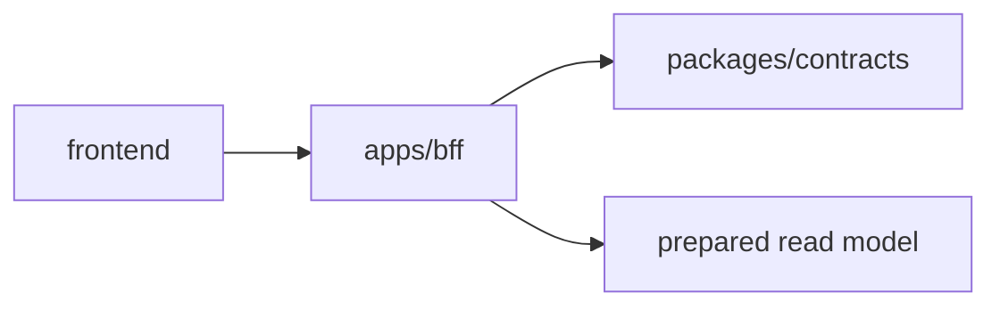

# BFF Frontend Onboarding Guide

This document is a guide for frontend engineers to run `apps/bff` in development
and use it from screen implementation.

## Role of BFF

`apps/bff` is a read-only product API boundary for frontend.

The frontend treats the BFF endpoint and API contracts defined in
`packages/contracts` as a boundary, and does not depend directly on chain,
SDK, DB, or fixtures.



## Prerequisites

- `bun install` already run at repo root
- BFF is started using Bun
- Regular frontend development should not assume fan-out requests to live RPC or
  external services

Main related locations:

```txt
apps/bff/README.md
apps/bff/src/http.ts
apps/bff/src/data/
packages/contracts
docs/phase-b/api-contract.md
```

## How to start

From repository root:

```bash
bun --filter bff start
```

From within `apps/bff`:

```bash
bun run start
```

Default port is `3001`.

```txt
http://localhost:3001
```

To change the port, set `PORT`:

```bash
PORT=3002 bun --filter bff start
```

## Frontend configuration

Manage the BFF base URL with environment variables in the frontend app.

Vite example:

```env
VITE_BFF_BASE_URL=http://localhost:3001
```

Next.js example:

```env
NEXT_PUBLIC_BFF_BASE_URL=http://localhost:3001
```

API client example:

```ts
const BFF_BASE_URL = process.env.NEXT_PUBLIC_BFF_BASE_URL ?? "http://localhost:3001";

export async function fetchCustomers() {
  const response = await fetch(`${BFF_BASE_URL}/customers`);

  if (!response.ok) {
    throw new Error(`failed to fetch customers: ${response.status}`);
  }

  return response.json();
}
```

## Available endpoints

### Health check

```http
GET /health
```

Health check endpoint to verify BFF is running.

### Customer list

```http
GET /customers
```

Returns customer list and is used for the customers list screen and dashboard entry.

### Customer profile

```http
GET /customers/:address/profile
```

Returns customer profile bound to wallet address. Address normalization is performed
on BFF side.

### Wallet usage graph

```http
GET /wallet-usage-graph
```

Returns a graph payload showing wallet-to-provider usage relationships.

## API contract

BFF product endpoints follow the API contract defined in
`packages/contracts`.

Frontend should treat BFF endpoint responses and contract as boundaries, and should
not depend directly on fixture structure under `apps/bff/src/data/*`.

See `docs/phase-b/api-contract.md` for detailed DTO structures.

## Read-only constraints

BFF product endpoints accept only GET.

- `GET` returns JSON response on success
- non-GET methods return `405 method_not_allowed`
- unknown routes return `404 not_found`

Frontend must not call POST, PUT, PATCH, or DELETE.

## Development notes

- Frontend depends on BFF endpoints and API contract.
- Frontend does not depend directly on internals under
  `apps/bff/src/data/`.
- Before changing payload shape, confirm `packages/contracts` and
  `docs/phase-b/api-contract.md` first.
- Do not include live RPC or external service checks in normal `verify` flow.
- On frontend screens, check `response.ok`, and handle `404 / 405 / network`
  errors.

## Verification

Run full verification from repository root.

```bash
bun run verify
```

To verify only BFF:

```bash
bun --filter bff verify
```

To run tests only:

```bash
bun --filter bff test
```

## Common issues

### `fetch failed` or connection error

- Confirm BFF is running.
- Confirm frontend base URL points to `http://localhost:3001`.
- If `PORT` is changed, align frontend environment variable as well.

### `404 not_found`

- Confirm endpoint path is correct.
- For customer profile, confirm the address exists in demo data.

### `405 method_not_allowed`

- Confirm you are not calling non-GET methods.

## Related documents

- `apps/bff/README.md`
- `docs/phase-b/api-contract.md`
- `packages/contracts`
