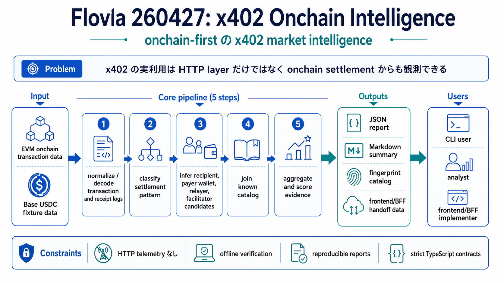

# Flovia 260427: x402 Onchain Intelligence



> この図は、Flovia 260427 の目的、入力、解析 pipeline、出力、利用者を1枚で把握するための概要図です。画像を更新する場合は [`docs/assets/infographics/common.prompt.md`](./assets/infographics/common.prompt.md) とこの Markdown 本文を使って再生成します。

## 30秒で分かる概要

Flovia 260427 は、EVM 上の x402-like payment を onchain settlement data から解析し、HTTP telemetry に依存せずに settlement pattern、recipient intelligence、relayer / facilitator activity、payer wallet overlap、known catalog との照合結果を可視化する offline-first な分析基盤です。

```text
onchain transaction / fixture data
  -> normalize / decode
  -> classify settlement pattern
  -> build recipient / payer / facilitator candidates
  -> join known catalog
  -> aggregate
  -> JSON / Markdown report
```

## 1. これは何か

Flovia 260427 は、EVM 上の x402 支払い transaction を onchain data から解析し、x402 ecosystem の実利用を可視化する分析基盤です。

この product では、API header、request URL、`resource`、referrer、response body は前提にしません。最初は EVM onchain settlement data に絞ります。

今回の scope は EVM 特化です。Solana は対象外とし、別 parser family が必要な将来拡張として扱います。

そのため、目的は一般的な API analytics ではなく、**onchain-first の x402 market intelligence** です。

見たいものは次です。

```text
どの x402-like payment が実際に起きているか
どの settlement pattern が使われているか
どの recipient wallet が volume を持っているか
どの relayer / facilitator が settlement を実行しているか
middleman 経由らしい payment がどれくらいあるか
同じ payer wallet が他にどの x402 product 候補を使っているか
known catalog と照合した時に、どの provider / service 候補に紐づくか
```

---

## 2. 解きたい課題

x402 ecosystem では、HTTP layer を見ないと endpoint や use case は特定しづらいです。一方で、onchain layer だけでも支払い実績と settlement infra の動きは読めます。

| 課題 | 内容 |
| --- | --- |
| x402-like tx の検出 | Base USDC などの EVM payment rail から x402 settlement らしい transaction を抽出する |
| settlement pattern 分類 | Direct USDC、Multicall3 helper などの実行パターンを分ける |
| recipient intelligence | どの受取 wallet が tx count / volume を持っているかを見る |
| relayer / facilitator intelligence | どの EOA / helper contract / settlement path が使われているかを見る |
| payer wallet intelligence | payer wallet を軸に、他に使っている x402 product 候補や cross-product overlap を見る |
| middleman inference | Orthogonal-like、Paysponge-like、direct-like activity を confidence 付きで推定する |
| catalog join | recipient wallet を公開 catalog と照合し、provider / service / use case 候補を補完する |

---

## 3. 前提と制約

この product では、HTTP telemetry を使いません。

直接は分からないもの。

```text
実際に呼ばれた endpoint
request path
resource URL
API response semantics
user がどこから来たか
referrer / source / medium
provider の完全な特定
use case の完全な特定
```

onchain から取得できるもの。

```text
tx hash
chain / network
block number / block time
tx.from
tx.to
function selector
receipt logs
payer
recipient
amount
asset
authorization nonce
relayer EOA
settlement pattern
recipient wallet grouping
facilitator candidate
middleman candidate
```

対象外。

```text
Solana transaction parsing
SPL Token transfer parsing
Solana fee payer / token account owner resolution
Solana memo / instruction based fingerprinting
non-EVM chain specific parser
```

重要な注意点。

```text
tx.from は実ユーザーではなく relayer の可能性が高い
recipient は provider とは限らず、middleman 管理 wallet の可能性がある
tx.to は final recipient ではなく settlement helper contract の可能性がある
Base USDC や transferWithAuthorization だけでは x402 と断定しない
user と呼ぶ場合も、実体は payer wallet / buyer wallet candidate として扱う
```

---

## 4. 最初に対象にする settlement pattern

MVP では EVM、特に Base mainnet の USDC settlement に絞ります。

Solana は `tx.to`、function selector、EVM receipt log がないため、この product の初期 fingerprint とは別物として扱います。

### Pattern A: Direct USDC

```text
tx.to == Base USDC
selector == 0xe3ee160e
receipt includes AuthorizationUsed + Transfer
```

想定される関数。

```text
transferWithAuthorization(address,address,uint256,uint256,uint256,bytes32,uint8,bytes32,bytes32)
```

読み方。

```text
USDC contract を直接呼ぶ settlement pattern
Orthogonal-style settlement と相性がある
receipt logs から payer / recipient / amount を復元できる
```

ただし、この pattern だけで Orthogonal と断定しません。known relayer、known recipient wallet、catalog match と組み合わせます。

### Pattern B: Multicall3 Helper

```text
tx.to == 0xca11bde05977b3631167028862be2a173976ca11
selector == 0x82ad56cb
inner call target == Base USDC
inner selector == 0xcf092995
receipt includes AuthorizationUsed + Transfer
```

想定される外側の関数。

```text
aggregate3((address,bool,bytes)[])
```

読み方。

```text
Multicall3 helper 経由の settlement pattern
Paysponge-style や helper contract 経由 settlement の候補
inner call と receipt logs を見て x402-like payment かを確認する
```

注意点。

```text
0xca11... は canonical Multicall3 なので、それだけでは x402 固有の fingerprint ではない
inner USDC authorization transfer と log pattern まで見る
```

---

## 5. データモデル

### payment_observations

onchain から観測した transaction 単位の fact table。

```text
tx_hash
chain_id
block_number
block_time
tx_from
tx_to
selector
asset_contract
payer
recipient
amount
authorization_nonce
log_topics
inner_calls
settlement_pattern
relayer_cluster_id
recipient_cluster_id
facilitator_candidate
middleman_candidate
provider_candidate
confidence
evidence_notes
```

### known_fingerprints

既知の signal を保存する catalog。

正式なフィンガープリントカタログの seed format、evidence、confidence、
conflict handling は `fingerprint-catalog.md` にまとめます。

```text
entity_type
entity_name
signal_type
signal_value
confidence
source
first_seen_at
last_seen_at
```

例。

```text
entity_type: middleman
entity_name: Orthogonal
signal_type: recipient_wallet
signal_value: 0x...
confidence: medium
source: docs/x402-analysis
```

### payer_wallet_profiles

`payer` を軸にした wallet-level intelligence 用の table。

`payer` は `tx.from` ではなく、authorization / receipt log から復元した payer を使います。

```text
payer
chain_id
first_seen_at
last_seen_at
tx_count
total_volume_usd
unique_recipients
unique_middleman_candidates
unique_provider_candidates
used_settlement_patterns
used_product_candidates
repeat_days
cross_product_score
wallet_type_candidate
confidence
```

`payer` は end user wallet とは限りません。agent wallet、organization wallet、custodial wallet、runtime wallet、shared testing wallet の可能性があります。そのため、UI では user ではなく payer wallet または buyer wallet candidate と表現します。

### daily_metrics

日次集計用の table または materialized view。

```text
date
chain_id
settlement_pattern
recipient
relayer
facilitator_candidate
middleman_candidate
tx_count
volume_usd
unique_payers
unique_recipients
confidence_bucket
```

---

## 6. Attribution logic

### Facilitator 推定

facilitator / settlement infra は onchain signal と相性がよいです。

強い signal。

```text
tx.to
function selector
receipt log pattern
inner call target
inner call selector
relayer EOA pool
settlement contract pattern
```

### Middleman 推定

middleman は HTTP host や path が強い signal です。onchain only では断定しづらいですが、次を組み合わせれば候補を出せます。

```text
known recipient wallet
known relayer pool
settlement pattern
recipient wallet grouping
catalog wallet match
amount pattern
time window clustering
```

例。

```text
Direct USDC pattern
+ known Orthogonal recipient wallet
+ known Orthogonal-like relayer
=> Orthogonal candidate, medium confidence
```

```text
Multicall3 helper pattern
+ known Paysponge-like relayer
+ repeated recipient grouping
=> Paysponge-like candidate, medium confidence
```

### Provider 推定

provider は onchain only だと弱いです。recipient wallet を公開 catalog と join して候補を出します。

```text
recipient wallet -> catalog service -> provider candidate
```

confidence は原則 weak から開始します。複数 signal が一致した場合だけ medium に上げます。

### Payer wallet 分析

Product 260427 では、recipient だけでなく payer wallet も主要な分析軸にします。

同じ payer が複数の recipient、middleman candidate、settlement pattern に支払っている場合、次を推定できます。

```text
その payer が他に使っている x402 product 候補
product 間の overlap
初回利用 product から次に使った product
repeat usage
cross-product expansion
wallet-level retention
```

例。

```text
payer 0xabc...
  - OpenMart-like recipient に支払い
  - Z.ai-like recipient に支払い
  - Paysponge-like pattern で支払い
  - unknown x402-like recipient に支払い
```

この場合、`0xabc...` は複数の x402 product 候補を使っている buyer wallet candidate として扱います。

ただし、payer wallet は実ユーザー本人とは限らないため、`user identity` ではなく `payer wallet behavior` として分析します。

---

## 7. Dashboard

### 1. Settlement Overview

目的は、x402-like payment の全体像を見ること。

```text
x402-like tx count
daily volume
Direct USDC vs Multicall3 split
asset split
network split
unique payer count
unique recipient count
new settlement pattern
```

### 2. Recipient Intelligence

目的は、どの wallet が実際に payment volume を持っているかを見ること。

```text
top recipient wallets
recipient 別 volume
recipient 別 tx count
recipient 別 payer count
recipient 別 settlement pattern
recipient 別 known catalog match
recipient 別 middleman candidate
```

### 3. Payer Wallet Intelligence

目的は、payer wallet が他にどの x402 product 候補を使っているかを見ること。

```text
top payer wallets
payer 別 tx count
payer 別 total volume
payer 別 used product candidates
payer 別 used recipient wallets
payer 別 used middleman candidates
payer 別 used settlement patterns
first seen / last seen
repeat days
cross-product score
```

### 4. Product Overlap

目的は、product / provider / middleman candidate 間の wallet overlap を見ること。

```text
OpenMart-like payer が他に使う product 候補
Orthogonal-like payer が Paysponge-like product も使う比率
AI 系 product 候補と data enrichment 系 product 候補の overlap
first product -> second product の transition
cross-product retention
```

### 5. Relayer / Facilitator Intelligence

目的は、settlement を実行している infra を見ること。

```text
top relayer EOAs
relayer 別 tx count
relayer 別 volume
relayer 別 recipient count
relayer 別 settlement pattern
facilitator candidate
new relayer detection
```

### 6. Middleman Inference

目的は、middleman-like activity を confidence 付きで読むこと。

```text
middleman candidate
confidence
evidence
matched recipient wallets
matched relayers
matched settlement pattern
volume
tx count
```

---

## 8. MVP scope

### Phase 1: Base USDC Collector

Base mainnet の transaction / logs から以下を抽出します。

```text
Direct USDC transferWithAuthorization
Multicall3 helper settlement
AuthorizationUsed logs
Transfer logs
```

成果物。

```text
payment_observations table
settlement_pattern classification
daily tx / volume metrics
```

### Phase 2: Fingerprint Catalog

`docs/x402-analysis/` の既知情報を seed 化します。

```text
known settlement patterns
known relayers
known recipient wallets
known middlemen
known facilitators
```

成果物。

```text
known_fingerprints table
confidence scoring
middleman candidate inference
```

### Phase 3: Clustering

以下の軸で cluster を作ります。

```text
payer wallet
recipient wallet
relayer EOA
tx.to
selector
inner selector
amount pattern
time window
authorization nonce behavior
```

成果物。

```text
payer wallet profiles
product overlap matrix
recipient clusters
relayer clusters
unknown x402-like clusters
new activity alerts
```

### Phase 4: Catalog Join

API header 解析ではなく、公開 catalog との join のみ行います。

join key。

```text
recipient wallet
network
asset
amount
known service detail
```

成果物。

```text
provider candidate
service candidate
use case candidate
confidence
```

---

## 9. 実現可能性

実現可能です。

ただし、Flovia 260427 は最初から「どの endpoint が使われたか」を当てる product ではありません。また、今回の対象は EVM onchain data です。onchain only では、主に以下を高精度に扱います。

```text
payment activity
settlement pattern
payer wallet behavior
cross-product usage
recipient wallet
relayer / facilitator
middleman-like cluster
volume / frequency
```

endpoint、use case、acquisition source は onchain だけでは弱いです。そのため、後続で catalog join や optional HTTP telemetry を追加します。

Solana でも payer wallet intelligence という考え方自体は応用できますが、必要な parser と fingerprint が違います。今回の product では扱いません。

---

## 10. 初期アウトプット例

```text
Base x402-like payments: 1,240 tx / 7 days

Settlement pattern:
- Direct USDC: 68%
- Multicall3 helper: 32%

Top recipient wallets:
1. 0xabc... - $420 - 310 tx - Orthogonal candidate
2. 0xdef... - $180 - 92 tx - unknown provider
3. 0x123... - $95 - 61 tx - Paysponge-like

Top payer wallets:
1. 0xaaa... - 12 tx - 4 product candidates - OpenMart-like, Z.ai-like, unknown
2. 0xbbb... - 8 tx - 2 middleman candidates - Orthogonal-like, Paysponge-like

Product overlap:
- OpenMart-like payers also used Z.ai-like: 22%
- Orthogonal-like payers also used Paysponge-like: 9%

Top relayers:
1. 0x67b9... - 240 tx - Direct USDC
2. 0xb2bd... - 180 tx - Multicall3 helper

Middleman inference:
- Orthogonal-like: 52% of tx volume
- Paysponge-like: 18%
- Direct / unknown: 30%
```

---

## 11. Positioning

Flovia 260427 は、**EVM onchain-first x402 market intelligence** です。

HTTP analytics ではなく、支払い実績から x402 ecosystem の実利用を読みます。

最初の顧客価値は GTM dashboard というより、次に近いです。

```text
settlement intelligence
ecosystem observability
competitive mapping
buyer wallet overlap analysis
middleman / facilitator activity tracking
```

その後、catalog join や HTTP telemetry を追加することで、endpoint / use case / acquisition source まで拡張できます。
