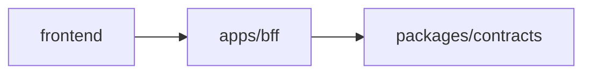

# BFF フロントエンド導入ガイド

このドキュメントは、フロントエンドエンジニアが BFF に接続し、利用可能な endpoint を把握するためのガイドです。

## BFF の役割

`apps/bff` は、フロントエンド向けの read-only なプロダクト API 境界です。

フロントエンドは BFF endpoint と `packages/contracts` で定義された API contract を境界として扱い、chain、SDK、DB、fixture には直接依存しません。



## 前提条件

- repo root で `bun install` が実行済み
- BFF は Bun で起動する
- 通常のフロントエンド開発では、live RPC や外部サービスへの fan-out request を前提にしない

主な関連場所:

```txt
apps/bff/README.md
apps/bff/src/http.ts
packages/contracts
docs/phase-b/api-contract.md
```

## 起動方法

repository root から:

```bash
bun --filter bff start
```

`apps/bff` 内から:

```bash
bun run start
```

default port は `3001` です。

```txt
http://localhost:3001
```

port を変更する場合は `PORT` を指定します。

```bash
PORT=3002 bun --filter bff start
```

## フロントエンド設定

フロントエンド app では環境変数で BFF base URL を管理します。

Next.js 例:

```env
BFF_URL=http://localhost:3001
NEXT_PUBLIC_BFF_URL=/api
```

API client 例:

```ts
const BFF_BASE_URL = process.env.BFF_URL ?? "http://localhost:3001";

export async function fetchCustomers() {
  const response = await fetch(`${BFF_BASE_URL}/customers`);

  if (!response.ok) {
    throw new Error(`failed to fetch customers: ${response.status}`);
  }

  return response.json();
}
```

## 利用可能な endpoint

### Health check

```http
GET /health
```

BFF が起動していることを確認するための health check endpoint です。

### Customer list

```http
GET /customers
```

customer list を返します。customers list screen や dashboard entry で利用します。

### Customer profile

```http
GET /customers/:address/profile
```

wallet address に紐づく customer profile を返します。address normalization は BFF 側で行います。

### Customer intelligence

```http
GET /customers/:address/intelligence
```

sampled address に対する wallet-level customer intelligence を返します。x402 payTo activities、matched service candidates、portfolio coverage、derived insights を含みます。address normalization は BFF 側で行います。

### Wallet usage graph

```http
GET /wallet-usage-graph
```

wallet と provider の利用関係を表す graph payload を返します。

### CoinGecko service summary

```http
GET /analytics/services/coingecko/summary
```

CoinGecko x402 service の summary analytics を返します。user count、transaction count、average transactions per user、repeat-user rate、top endpoints、comparison metadata を含みます。

この endpoint は現在の PoC では意図的に CoinGecko 専用です。他 service は per-service summary endpoint ではなく、下記の comparison / quadrant endpoint で確認します。

### Service comparison

```http
GET /analytics/services/comparison
```

利用可能な x402 services 全体の service-level comparison analytics を返します。comparison table、ranking、peer benchmarking 向けの payload です。生成済み analytics read model 由来の CoinGecko と peer services を含みます。

### Service quadrants

```http
GET /analytics/services/quadrants
```

average transactions per user と endpoint diversity によって service を可視化するための quadrant-ready analytics points を返します。生成済み analytics read model 由来の CoinGecko と peer services を含みます。

## API contract

BFF product endpoints は `packages/contracts` で定義された API contract に従います。

フロントエンドは BFF endpoint response と contract を境界として扱ってください。

詳細な DTO 構造は `docs/phase-b/api-contract.md` を参照してください。

## Read-only 制約

BFF product endpoints は GET のみ受け付けます。

- `GET` は成功時に JSON response を返す
- GET 以外の method は `405 method_not_allowed` を返す
- unknown route は `404 not_found` を返す

フロントエンドから POST、PUT、PATCH、DELETE は呼ばないでください。

## 開発メモ

- フロントエンドは BFF endpoints と API contract に依存します。
- payload shape を変更する前に、必ず `packages/contracts` と `docs/phase-b/api-contract.md` を確認してください。
- 通常の `verify` flow に live RPC や外部サービス check を含めないでください。
- フロントエンド画面では `response.ok` を確認し、`404 / 405 / network` error を扱ってください。

## Verification

repository root から full verification を実行します。

```bash
bun run verify
```

BFF だけ確認する場合:

```bash
bun --filter bff verify
```

test だけ実行する場合:

```bash
bun --filter bff test
```

## よくある問題

### `fetch failed` または connection error

- BFF が起動していることを確認する。
- frontend base URL が `http://localhost:3001` を指していることを確認する。
- `PORT` を変更した場合は、frontend の環境変数も合わせる。
- Docker Compose では、frontend は内部的に `BFF_URL=http://bff:3001` を使います。

### `404 not_found`

- endpoint path が正しいことを確認する。
- customer profile / intelligence の場合は、その address が BFF の現在の dataset に存在することを確認する。

### `405 method_not_allowed`

- GET 以外の method を呼んでいないことを確認する。

## 関連ドキュメント

- `apps/bff/README.md`
- `docs/phase-b/api-contract.md`
- `packages/contracts`
