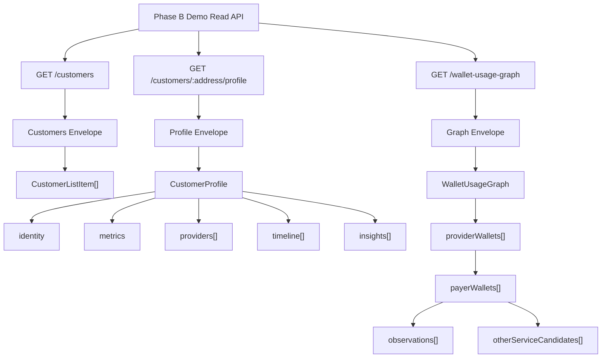
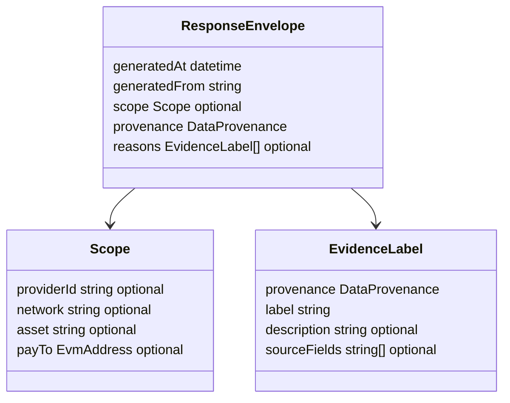
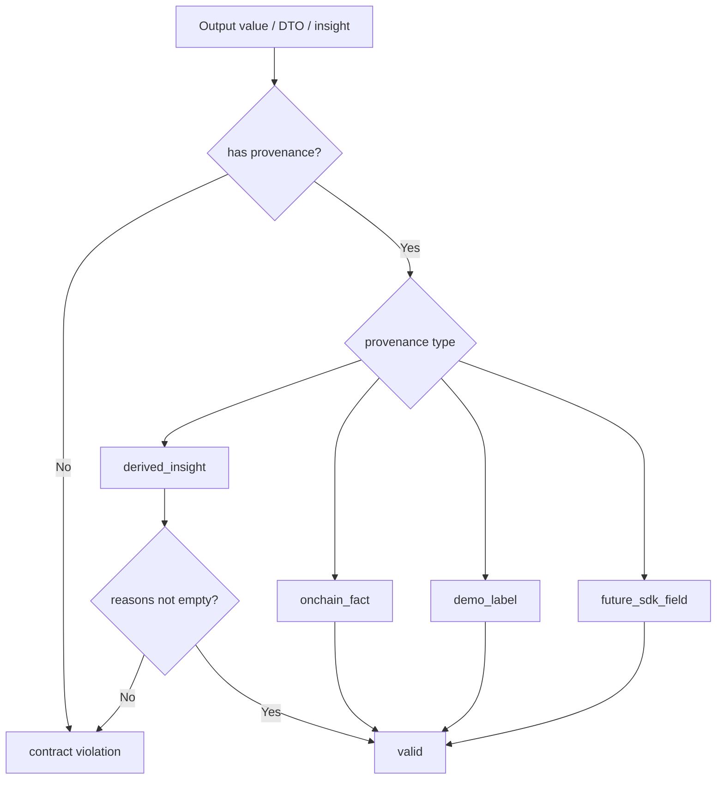
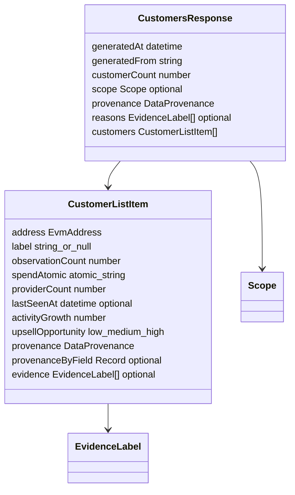
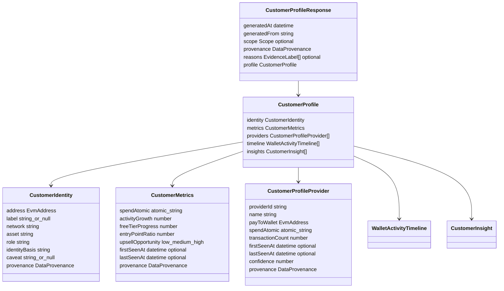
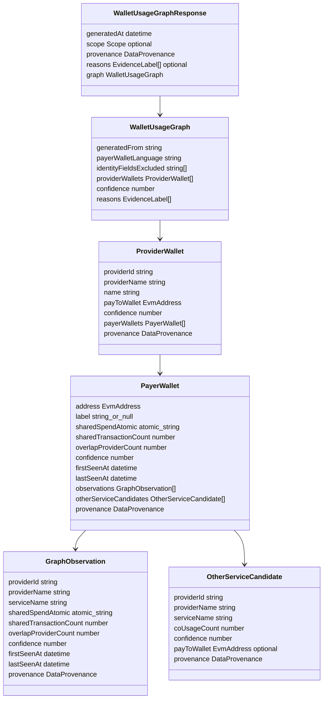
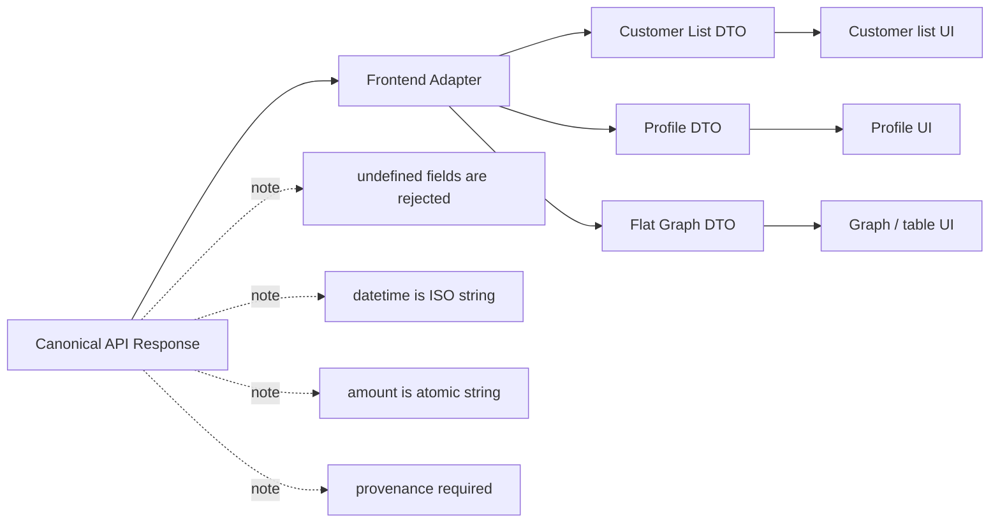

# Phase B API Contract (Demo Read API)

This document defines the Phase B contracts in `packages/contracts` and explains
how they relate to the frontend requirements in this repository.

## Overall structure

Phase B API returns canonical DTOs with a shared envelope and provenance for the
three Demo Read APIs.



### Common envelope and provenance





Key points:

- If `scope` is omitted, this is treated as global/unscoped demo data.
- All responses and nested schemas are strict and reject unknown fields.
- Atomic amount values are numeric strings.
- Timestamps are ISO-8601 strings.
- `derived_insight` is hypothesis; non-empty `reasons` is mandatory.

### Endpoint DTO structures



`GET /customers` is a lightweight summary of customer wallet list.
It must satisfy `customerCount === customers.length`.



`GET /customers/:address/profile` is a detailed view for one customer wallet.



`GET /wallet-usage-graph` represents payer/provider overlap and co-usage using
nested structures with evidence.

### Frontend integration view



Compatibility differences with existing frontend are handled by adapter.
Key points are that responses include an envelope (not bare arrays), timestamps
are ISO strings (not numbers), and the graph is nested.

### Frontend migration policy

In the initial Phase B integration with `../poc-frontend`, keep `../poc-frontend`
components without rewriting them directly to canonical response shapes. Convert
canonical response to existing UI DTO through API client or adapter layer.

This lets BFF keep the canonical envelope in `packages/contracts` while
migrating legacy UI display logic incrementally.

The following items are deferred until a later change:

- standalone `GET /patterns` endpoint
- restoring `GET /summary`
- query/header based provider scope
- live SDK telemetry collection and persistence

## Canonical contract strategy

Phase B uses canonical enveloped responses (shared wrapper shape) for
`/customers`, `/customers/:address/profile`, and `/wallet-usage-graph`:

- During frontend migration, existing code may temporarily reference convenience
  DTO shapes, but contract payloads must continue to follow this canonical
  specification.
- Frontend compatibility differences are explicitly defined in this document so the
  team can apply them progressively.

## Provenance contract

All emitted values must include one of the following provenance values:

`DataProvenance = ["onchain_fact", "demo_label", "future_sdk_field", "derived_insight"]`.

- `derived_insight` must not be treated as a confirmed fact because it explicitly
  represents hypotheses.

### Provenance fields

- `provenance: DataProvenance` (object-level provenance)
- `provenanceByField?: Record<string, DataProvenance>` (field-level provenance)
- `reasons?: EvidenceLabel[]` (optional list of reasons)

`provenanceByField` is used when an object mixes fields from different sources.
It is especially useful for fields involving `demo_label`, `future_sdk_field`, and
`derived_insight`.

When any DTO or insight has `provenance === "derived_insight"`, non-empty
`reasons` is mandatory and must be kept.

Reusable metadata:

- `EvidenceLabel = { provenance, label, description?, sourceFields? }`

All Phase B responses and nested schemas are strict (`.strict()`), rejecting
unknown fields.

Atomic values use decimal-free atomic unit representation, so they must follow
`"^\\d+$"` (digits only).

## Date / timestamp format

Contract requires ISO-8601 strings (`z.string().datetime()`).

Frontend migration note: existing logic may currently parse numeric timestamps.
When aligning UI to ISO string contracts, convert using
`Date.parse` / `toISOString`.

## Shared conventions

- Nullable `label` fields use canonical form (`label: string | null`) to reduce
  schema fragility across languages.
- `payTo`, `address`, and wallet-like identifiers in Phase B contracts are
  normalized lowercase `EvmAddress` values (Base/EVM addresses).
- Response envelope scope is explicit and optional.
  - `providerId?: string`
  - `network?: string`
  - `asset?: string`
  - `payTo?: string`

If scope is omitted, the payload is treated as demo/global data for that
projection.

## 1. `GET /customers`

Returns customer projection list.

### Response envelope

- `generatedAt: string (datetime)`
- `generatedFrom: string`
- `customerCount: number`
- `scope?: { providerId?, network?, asset?, payTo? }`
- `provenance: DataProvenance`
- `reasons?: EvidenceLabel[]`
- `customers: CustomerListItem[]`

Constraint: `customerCount === customers.length`.

`CustomerListItem` fields:

- `address: EvmAddress`
- `label: string | null`
- `observationCount: number`
- `spendAtomic: string` (digits only)
- `providerCount: number`
- `lastSeenAt?: string (datetime)`
- `activityGrowth: number`
- `upsellOpportunity: "low" | "medium" | "high"`
- `provenance: DataProvenance`
- `provenanceByField?: Record<string, DataProvenance>`
- `evidence?: EvidenceLabel[]`

### Frontend compatibility note

Existing frontend may handle nullable labels in direct arrays and may accept
legacy fields. Canonical payload keeps an explicit `scope` to preserve shape.

### Example

```json
{
  "generatedAt": "2026-01-01T00:00:00Z",
  "generatedFrom": "phase-b-demo",
  "customerCount": 2,
  "scope": {
    "providerId": "provider-1",
    "network": "base",
    "asset": "USDC"
  },
  "provenance": "onchain_fact",
  "customers": [
    {
      "address": "0x1111111111111111111111111111111111111111",
      "label": "acme-wallet",
      "observationCount": 42,
      "spendAtomic": "1000000",
      "providerCount": 3,
      "activityGrowth": 0.32,
      "upsellOpportunity": "high",
      "provenance": "onchain_fact"
    },
    {
      "address": "0x2222222222222222222222222222222222222222",
      "label": null,
      "observationCount": 8,
      "spendAtomic": "0",
      "providerCount": 1,
      "activityGrowth": -0.2,
      "upsellOpportunity": "low",
      "provenance": "demo_label"
    }
  ]
}
```

## 2. `GET /customers/:address/profile`

Returns projection for one customer wallet profile.

### Response envelope

- `generatedAt: string (datetime)`
- `generatedFrom: string`
- `scope?: { providerId?, network?, asset?, payTo? }`
- `provenance: DataProvenance`
- `reasons?: EvidenceLabel[]`
- `profile: CustomerProfile`

`CustomerProfile` fields:

- `identity`
  - `address: EvmAddress`
  - `label: string | null`
  - `network: string`
  - `asset: string`
  - `role: string`
  - `identityBasis: string`
  - `caveat: string | null`
  - `provenance`
  - `provenanceByField?`
  - `evidence?`
- `metrics`
  - `spendAtomic: string`
  - `activityGrowth: number`
  - `freeTierProgress: number`
  - `entryPointRatio: number`
  - `upsellOpportunity: "low" | "medium" | "high"`
  - `firstSeenAt?: string (datetime)`
  - `lastSeenAt?: string (datetime)`
  - `provenance`
  - `provenanceByField?`
  - `evidence?`
- `providers: CustomerProfileProvider[]`
- `timeline: WalletActivityTimeline[]`
- `insights: CustomerInsight[]`

`CustomerProfileProvider` fields:

- `providerId: string`
- `name: string`
- `payToWallet: EvmAddress`
- `spendAtomic: string`
- `transactionCount: number`
- `firstSeenAt?: string (datetime)`
- `lastSeenAt?: string (datetime)`
- `confidence: number`
- `provenance`
- `provenanceByField?`
- `evidence?`
- `caveat?`

`WalletActivityTimeline` and `CustomerInsight` support `provenance` and optional
`reasons`. If `provenance === "derived_insight"`, `reasons` is mandatory.

### Frontend compatibility note

Legacy profile consumers may flatten provider metrics using legacy names such as
`providerName`, `txCount`, or `totalSpendAtomic`. Keep alias support in the
adapter as needed while transitioning canonical field names.

## 3. `GET /wallet-usage-graph`

Returns co-usage signal graph for payer/provider overlap.

### Response envelope

- `generatedAt: string (datetime)`
- `scope?: { providerId?, network?, asset?, payTo? }`
- `provenance: DataProvenance`
- `reasons?: EvidenceLabel[]`
- `graph: WalletUsageGraph`

`WalletUsageGraph` fields:

- `generatedFrom: string`
- `payerWalletLanguage: string`
- `identityFieldsExcluded: string[]`
- `providerWallets: ProviderWallet[]`
- `confidence: number`
- `reasons: EvidenceLabel[]` (required at graph level)

`ProviderWallet` fields:

- `providerId: string`
- `providerName: string`
- `name: string`
- `payToWallet: EvmAddress`
- `confidence: number`
- `payerWallets: PayerWallet[]`
- `provenance`, `provenanceByField?`, `evidence?`

`PayerWallet` fields:

- `address: EvmAddress`
- `label: string | null`
- `sharedSpendAtomic: string`
- `sharedTransactionCount: number`
- `overlapProviderCount: number`
- `confidence: number`
- `firstSeenAt: string (datetime)`
- `lastSeenAt: string (datetime)`
- `observations: GraphObservation[]`
- `otherServiceCandidates: OtherServiceCandidate[]`
- `provenance`, `provenanceByField?`, `evidence?`

`GraphObservation` fields:

- `providerId: string`
- `providerName: string`
- `serviceName: string`
- `sharedSpendAtomic: string`
- `sharedTransactionCount: number`
- `overlapProviderCount: number`
- `confidence: number`
- `firstSeenAt: string (datetime)`
- `lastSeenAt: string (datetime)`
- `provenance`, `provenanceByField?`, `evidence?`

`OtherServiceCandidate` fields:

- `providerId: string`
- `providerName: string`
- `serviceName: string`
- `coUsageCount: number`
- `confidence: number`
- `payToWallet?: EvmAddress`
- `provenance`, `provenanceByField?`, `evidence?`

### Frontend compatibility note

Current frontend may prefer flattened payer/provider representations.
This nested structure is intentionally aligned to edge/evidence semantics. On the
consumer side, flatten by iterating `providerWallets[].payerWallets[]` and
expanding `observations` as needed.

## 4. Endpoint scope notes

Phase B demo responses now include an optional `scope` field.
When omitted, consumers must treat the payload as **global/unscoped demo data**.

The omission of scope must not be interpreted as hidden provider filtering.

## 5. Added / planned endpoints

- `GET /customers/:address/intelligence` (implemented): analysis endpoint returning
  customer-centric other x402 service candidates, payTo activity, portfolio/DeFi
  context, and derived insights. BFF does not call live external APIs and returns
  prepared read model. See
  `docs/phase-b/customer-intelligence.md` for policy and detailed contract.

## 6. Planned / not implemented endpoints

- `GET /patterns` (planning exists for Phase B; contract is not implemented yet)
