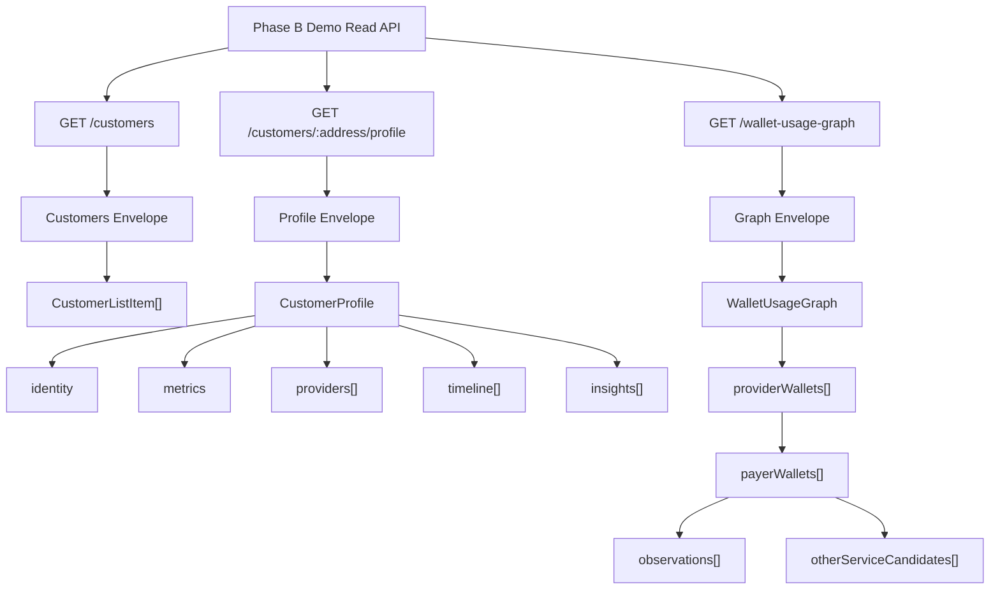
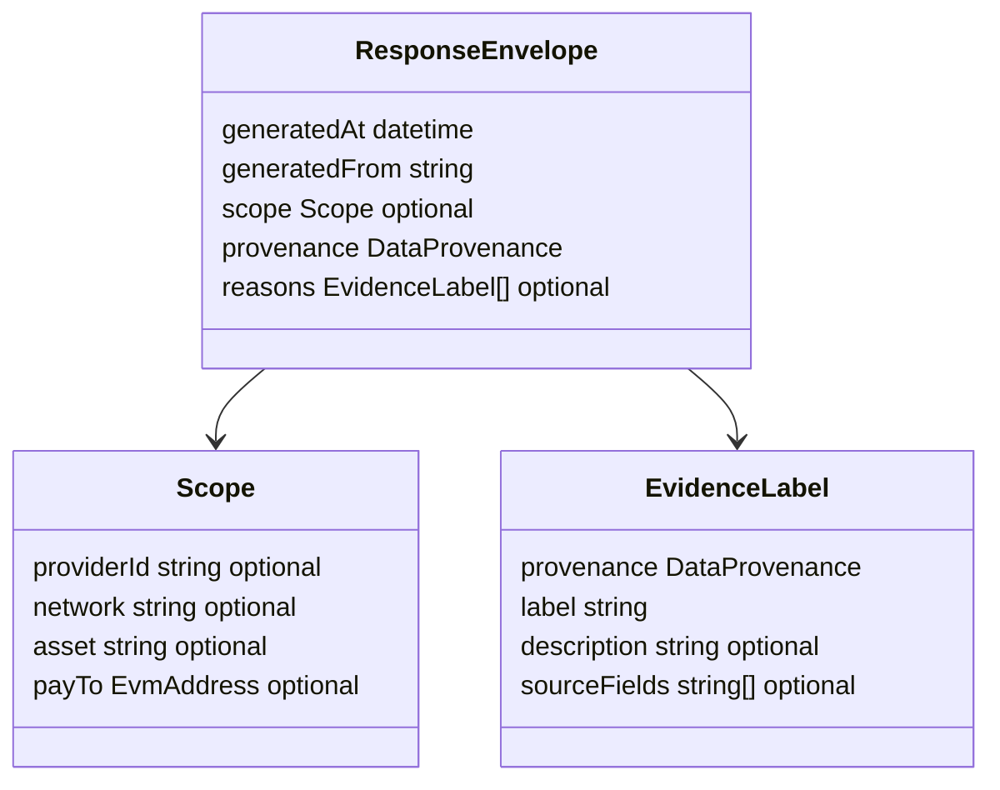
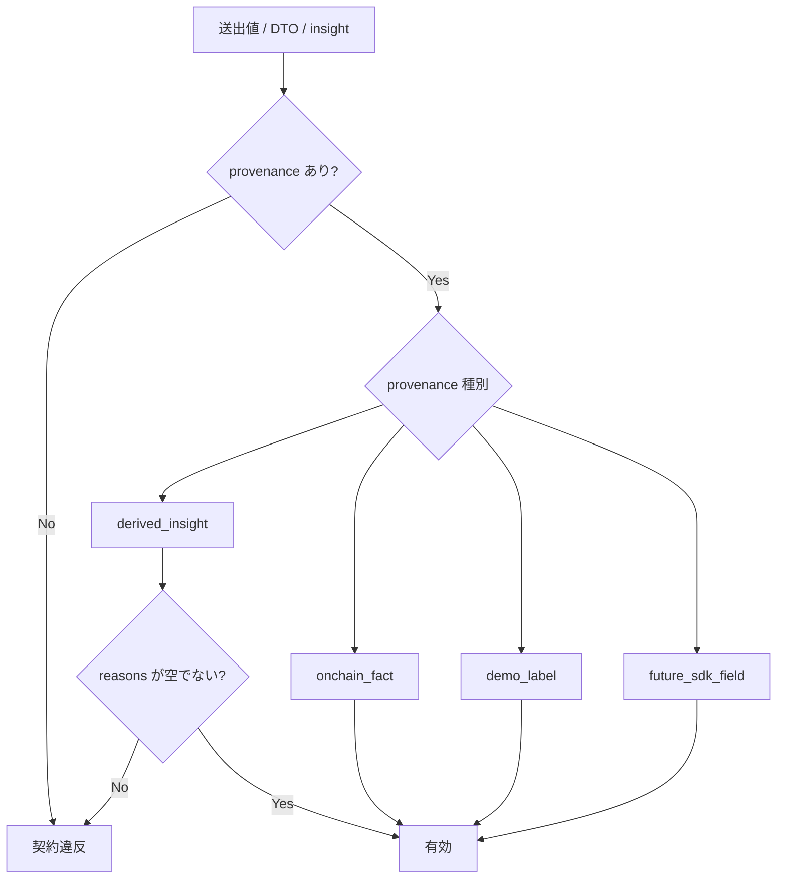
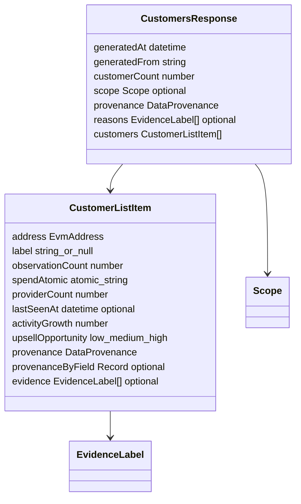
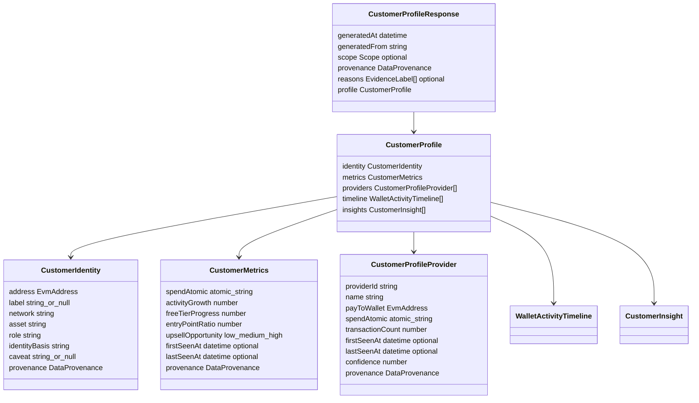
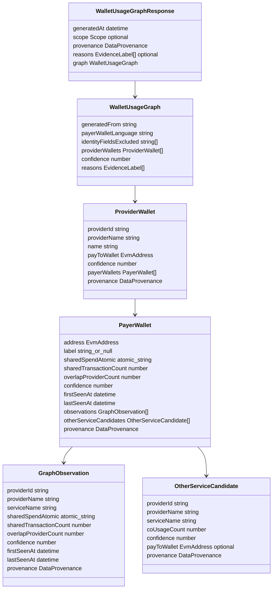
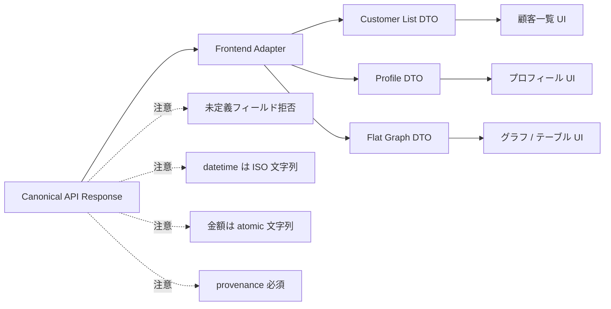

# Phase B API 契約（Demo Read API）

このドキュメントは `packages/contracts` の Phase B 契約を定義し、
現在のフロントエンド要件との関連を説明します。

## 構造の全体像

Phase B API は、3 つの Demo Read API が共通の envelope と provenance を持つ
canonical DTO を返す構造です。



### 共通 envelope と provenance





要点:

- `scope` が省略された場合は global/unscoped demo data として扱います。
- すべてのレスポンスおよび入れ子スキーマは strict で、未定義フィールドを拒否します。
- atomic 金額は数字のみの文字列です。
- タイムスタンプは ISO-8601 文字列です。
- `derived_insight` は仮説なので、空でない `reasons` が必須です。

### エンドポイント別の DTO 構造



`GET /customers` は顧客ウォレット一覧の軽量サマリです。
`customerCount === customers.length` を満たす必要があります。



`GET /customers/:address/profile` は 1 つの顧客ウォレットを深掘りする詳細ビューです。



`GET /wallet-usage-graph` は payer wallet と provider wallet の同時利用や重なりを、
evidence 付きのネスト構造で表します。

### フロントエンド連携時の見方



既存フロントエンドとの互換差分は adapter で吸収します。特に、直接配列ではなく
envelope 付きであること、timestamp が数値ではなく ISO 文字列であること、graph が
ネスト構造であることに注意してください。

### フロントエンド移行方針

Phase B の初回連携では、`../poc-frontend` の各 component を直接 canonical response
へ大きく書き換えるのではなく、frontend API client か adapter 層で canonical response
を既存 UI DTO へ変換します。

これにより、BFF 側は `packages/contracts` の canonical envelope を維持しつつ、既存 UI の
表示ロジックを段階的に移行できます。

以下は後続 change まで延期します。

- `GET /patterns` の独立 endpoint 化
- `GET /summary` の復活
- provider scope の query/header 化
- live SDK telemetry の取得・永続化

## 正規（Canonical）契約戦略

Phase B 契約は `/customers`、`/customers/:address/profile`、`/wallet-usage-graph`
に対して **canonical enveloped responses**（共通的なラップ付きレスポンス）を採用します。

- Phase B のフロントエンド連携コードは移行中に便宜上の DTO 形状を引き続き
  参照することがありますが、契約ペイロードはこの canonical 仕様に従い続ける必要があります。
- フロントエンド互換の差分はこのファイル内で明示的に定義し、チームが段階的に適用できる
  ようにします。

## Provenance 契約

すべての送出値は以下いずれかの provenance（出所）を含める必要があります。

`DataProvenance = ["onchain_fact", "demo_label", "future_sdk_field", "derived_insight"]`。

- `derived_insight` は明確に仮説を表すため、確定した事実として扱ってはいけません。

### Provenance フィールド

- `provenance: DataProvenance`（オブジェクト全体の provenance）
- `provenanceByField?: Record<string, DataProvenance>`（フィールド単位の provenance）
- `reasons?: EvidenceLabel[]`（任意の理由一覧）

`provenanceByField` は、フィールドが異なるソースに由来する混在オブジェクトで使用します。
特に `demo_label`、`future_sdk_field`、`derived_insight` が関係するフィールドで有効です。

いずれかの DTO またはインサイトで `provenance === "derived_insight"` の場合、
空でない `reasons` が必須であり、保持する必要があります。

再利用可能なメタデータ:

- `EvidenceLabel = { provenance, label, description?, sourceFields? }`

Phase B のレスポンスおよび入れ子スキーマはすべて strict（`.strict()`）であり、
未定義フィールドは拒否されます。

Atomic な値は金額が atomic 単位で表現されるため、10 進数や符号を持たず、
`"^\d+$"`（数字のみの文字列）を使用します。

## 日付 / タイムスタンプの形式

契約上、タイムスタンプは ISO-8601 文字列（`z.string().datetime()`）です。

フロントエンド移行ノート: 既存ロジックは場所によって数値タイムスタンプを
読み取っている可能性があります。UI 側を ISO 文字列契約へ合わせる際は、
`Date.parse`/`toISOString` で値を変換してください。

## 共通の規約

- `label` の nullable フィールドは canonical（`label: string | null`）で、言語間の
  スキーマ脆弱性を低減します。
- Phase B 契約の `payTo`、`address`、およびウォレットらしき識別子はすべて
  `EvmAddress`（40 進の Base/EVM アドレス、 lowercase 正規化）です。
- レスポンスの envelope scope は明示的かつ任意となりました。
  - `providerId?: string`
  - `network?: string`
  - `asset?: string`
  - `payTo?: string`

scope フィールドが省略された場合、このペイロードは該当プロジェクションの
デモ／グローバルデータとして扱います。

## 1. `GET /customers`

顧客プロジェクションの一覧を返します。

### レスポンス envelope

- `generatedAt: string (datetime)`
- `generatedFrom: string`
- `customerCount: number`
- `scope?: { providerId?, network?, asset?, payTo? }`
- `provenance: DataProvenance`
- `reasons?: EvidenceLabel[]`
- `customers: CustomerListItem[]`

**制約:** `customerCount === customers.length`。

`CustomerListItem` のフィールド:

- `address: EvmAddress`
- `label: string | null`
- `observationCount: number`
- `spendAtomic: string`（数字のみ）
- `providerCount: number`
- `lastSeenAt?: string (datetime)`
- `activityGrowth: number`
- `upsellOpportunity: "low" | "medium" | "high"`
- `provenance: DataProvenance`
- `provenanceByField?: Record<string, DataProvenance>`
- `evidence?: EvidenceLabel[]`

### フロントエンド互換ノート

既存のフロントエンドは、直接配列で nullable なラベルを扱い、
レガシーフィールドを許容する実装の場合があります。canonical ペイロードは
明示的な `scope` を付与してこの形状を維持します。

### 例

```json
{
  "generatedAt": "2026-01-01T00:00:00Z",
  "generatedFrom": "phase-b-demo",
  "customerCount": 2,
  "scope": {
    "providerId": "provider-1",
    "network": "base",
    "asset": "USDC"
  },
  "provenance": "onchain_fact",
  "customers": [
    {
      "address": "0x1111111111111111111111111111111111111111",
      "label": "acme-wallet",
      "observationCount": 42,
      "spendAtomic": "1000000",
      "providerCount": 3,
      "activityGrowth": 0.32,
      "upsellOpportunity": "high",
      "provenance": "onchain_fact"
    },
    {
      "address": "0x2222222222222222222222222222222222222222",
      "label": null,
      "observationCount": 8,
      "spendAtomic": "0",
      "providerCount": 1,
      "activityGrowth": -0.2,
      "upsellOpportunity": "low",
      "provenance": "demo_label"
    }
  ]
}
```

## 2. `GET /customers/:address/profile`

1 つの顧客ウォレットプロフィールのプロジェクションを返します。

### レスポンス envelope

- `generatedAt: string (datetime)`
- `generatedFrom: string`
- `scope?: { providerId?, network?, asset?, payTo? }`
- `provenance: DataProvenance`
- `reasons?: EvidenceLabel[]`
- `profile: CustomerProfile`

`CustomerProfile` のフィールド:

- `identity`
  - `address: EvmAddress`
  - `label: string | null`
  - `network: string`
  - `asset: string`
  - `role: string`
  - `identityBasis: string`
  - `caveat: string | null`
  - `provenance`
  - `provenanceByField?`
  - `evidence?`
- `metrics`
  - `spendAtomic: string`
  - `activityGrowth: number`
  - `freeTierProgress: number`
  - `entryPointRatio: number`
  - `upsellOpportunity: "low" | "medium" | "high"`
  - `firstSeenAt?: string (datetime)`
  - `lastSeenAt?: string (datetime)`
  - `provenance`
  - `provenanceByField?`
  - `evidence?`
- `providers: CustomerProfileProvider[]`
- `timeline: WalletActivityTimeline[]`
- `insights: CustomerInsight[]`

`CustomerProfileProvider` のフィールド:

- `providerId: string`
- `name: string`
- `payToWallet: EvmAddress`
- `spendAtomic: string`
- `transactionCount: number`
- `firstSeenAt?: string (datetime)`
- `lastSeenAt?: string (datetime)`
- `confidence: number`
- `provenance`, `provenanceByField?`, `evidence?`

`WalletActivityTimeline` と `CustomerInsight` は `provenance` と任意の
`reasons` をサポートします。`provenance === "derived_insight"` の場合、
`reasons` が必須です。

### フロントエンド互換ノート

従来のプロフィール利用側は、`providerName` / `txCount` や
`totalSpendAtomic` のようなレガシー名で provider metrics をフラット化している
ことがあります。canonical のフィールド名へ移行する際は、必要に応じてアダプター内で
これらの任意エイリアスを保持してください。

## 3. `GET /wallet-usage-graph`

payer/provider の同時利用シグナルグラフを返します。

### レスポンス envelope

- `generatedAt: string (datetime)`
- `scope?: { providerId?, network?, asset?, payTo? }`
- `provenance: DataProvenance`
- `reasons?: EvidenceLabel[]`
- `graph: WalletUsageGraph`

`WalletUsageGraph` のフィールド:

- `generatedFrom: string`
- `payerWalletLanguage: string`
- `identityFieldsExcluded: string[]`
- `providerWallets: ProviderWallet[]`
- `confidence: number`
- `reasons: EvidenceLabel[]`（graph レベルで必須）

`ProviderWallet` のフィールド:

- `providerId: string`
- `providerName: string`
- `name: string`
- `payToWallet: EvmAddress`
- `confidence: number`
- `payerWallets: PayerWallet[]`
- `provenance`, `provenanceByField?`, `evidence?`

`PayerWallet` のフィールド:

- `address: EvmAddress`
- `label: string | null`
- `sharedSpendAtomic: string`
- `sharedTransactionCount: number`
- `overlapProviderCount: number`
- `confidence: number`
- `firstSeenAt: string (datetime)`
- `lastSeenAt: string (datetime)`
- `observations: GraphObservation[]`
- `otherServiceCandidates: OtherServiceCandidate[]`
- `provenance`, `provenanceByField?`, `evidence?`

`GraphObservation` のフィールド:

- `providerId: string`
- `providerName: string`
- `serviceName: string`
- `sharedSpendAtomic: string`
- `sharedTransactionCount: number`
- `overlapProviderCount: number`
- `confidence: number`
- `firstSeenAt: string (datetime)`
- `lastSeenAt: string (datetime)`
- `provenance`, `provenanceByField?`, `evidence?`

`OtherServiceCandidate` のフィールド:

- `providerId: string`
- `providerName: string`
- `serviceName: string`
- `coUsageCount: number`
- `confidence: number`
- `payToWallet?: EvmAddress`
- `provenance`, `provenanceByField?`, `evidence?`

### フロントエンド互換ノート

現在のフロントエンドは、フラットな payer/provider 表現を好む場合があります。
上記のネスト構造は edge/evidence の意味論により近い形を意図しているため、
利用側では `providerWallets[].payerWallets[]` を走査し、必要に応じて
`observations` を展開することでフラットな DTO に変換できます。

## 4. エンドポイント scope ノート

Phase B のデモレスポンスには、scope フィールドが任意で含まれるようになりました。
省略された場合、利用側はこのペイロードを **global/unscoped デモデータ** として
扱う必要があります。

scope フィールドが省略されたことから、隠れた provider フィルタリングを
推定してはなりません。

## 5. 計画済み / 未実装エンドポイント

- `GET /patterns`（Phase B 計画は存在するが、契約は未実装）
- `GET /customers/:address/intelligence`（計画中。現時点の canonical Demo Read API には含めない。customer 起点の他 x402 service candidate、payTo activity、portfolio / DeFi context、derived insight を返す分析 endpoint。BFF は live external API を呼ばず、保存済み read model を返す。方針は `docs/phase-b/customer-intelligence.md` を参照）
