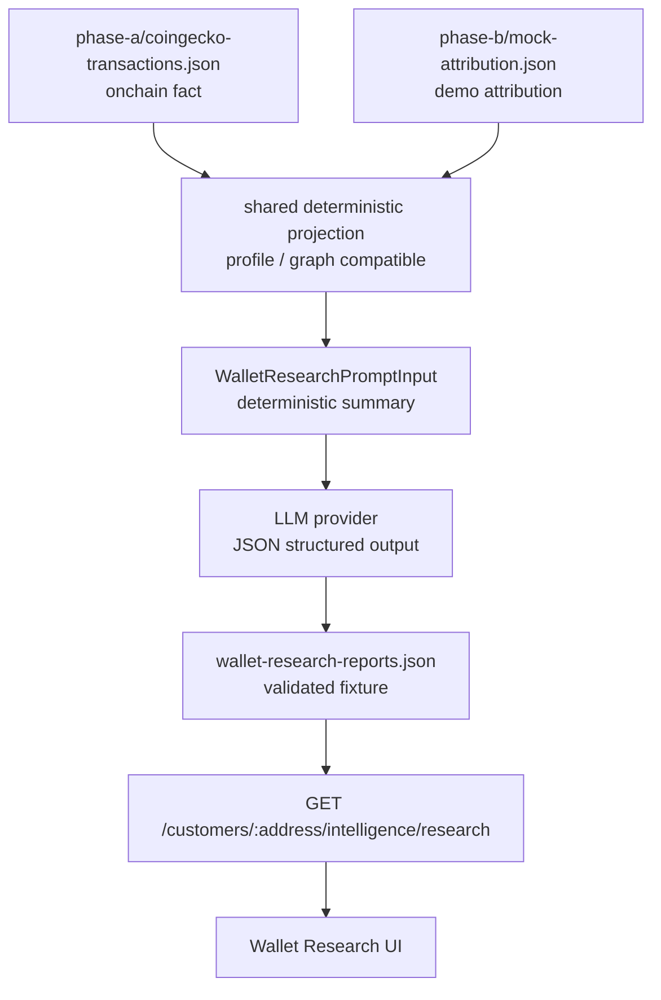

# Phase B Wallet Research Report 方針

## 目的

mock attribution と onchain fact から wallet address を分析し、その分析結果を LLM に渡して、UI に表示できる research report を生成する。

この文書では、`apps/bff` / `apps/cli` の現在の責務に合わせた実行形態、必要な contract、BFF endpoint、UI 表示方針を整理する。

## 現状

| 領域 | 対応状況 | 備考 |
| --- | --- | --- |
| onchain transfer fact 取得 | 実装済み | `apps/cli/scripts/analytics/capture-coingecko-transactions.ts` が Bitquery から取得 |
| mock endpoint attribution | 実装済み | `txHash -> endpointPath` を deterministic に生成 |
| Phase B read model | 実装済み | `apps/bff/src/data/projection-builder.ts` |
| wallet profile endpoint | 実装済み | `GET /customers/:address/profile` |
| wallet usage graph endpoint | 実装済み | `GET /wallet-usage-graph` |
| LLM research 生成 | 未実装 | LLM prompt / output schema / provider adapter がない |
| research report endpoint | 未実装 | 生成済み report を返す BFF endpoint がない |
| UI research 表示 | 未実装 | profile / evidence / LLM summary を合わせる画面が必要 |

## 基本方針

LLM 呼び出しは BFF の request path に入れない。

現在の BFF は read-only product API 境界であり、ユーザーリクエストごとに CDP、Bitquery、RPC、LLM などの外部サービスを呼ばない方針を維持する。

```text
apps/cli
  wallet:research generate
    -> fixture または共有 package の deterministic projection を読む
    -> deterministic research input を作る
    -> LLM に JSON report を生成させる
    -> packages/contracts で validation
    -> apps/bff/fixtures/... に保存

apps/bff
  新規
    -> 保存済み research report fixture を読む
    -> packages/contracts で validation
    -> read-only response を返す
```

この分離により、次を守れる。

- 通常の `bun run verify` を offline に保つ
- API token / retry / rate limit を CLI 側に閉じ込める
- BFF response を deterministic にする
- LLM provider や prompt version の差し替えをしやすくする
- UI は安定した contract だけを見る

`apps/cli` は `apps/bff/src/*` を import しない。profile / graph 相当の projection が CLI 側でも必要な場合は、次のどちらかを選ぶ。

- projection builder を `packages/intelligence` などの共有 package に抽出する
- BFF 用とは別に、CLI が保存済み projection artifact を読み込む

app-to-app coupling を避け、共有可能な deterministic logic は package に置く。

## 推奨データフロー



## `intelligence` との関係

既存の `customer-intelligence.md` では、将来 endpoint として `GET /customers/:address/intelligence` を第一候補にしている。

この文書で扱う `research` は、`intelligence` と競合する独立機能ではなく、`intelligence` から派生する LLM narrative として扱う。

| endpoint / concept | 役割 | 生成元 |
| --- | --- | --- |
| `profile` | Wallet 360° の基本 projection | onchain fact + mock attribution |
| `intelligence` | customer 起点の deterministic analysis / scoring / external context | packages/sources + packages/intelligence |
| `research` | deterministic evidence を人間向けに説明する LLM narrative | intelligence / profile / evidence |

実装時は次を第一候補にする。

```text
GET /customers/:address/intelligence/research
```

依存方向は次を守る。

```text
customer intelligence
  -> deterministic source of truth

intelligence research
  -> LLM-generated narrative derived from intelligence
```

`research` は `intelligence` に依存してよいが、`intelligence` は `research` に依存しない。`GET /customers/:address/intelligence` の MVP に LLM report を必須 field として混ぜると、実装中の deterministic intelligence が LLM contract / provider / generated fixture に引っ張られるため避ける。

Phase B の既存 canonical Demo Read API にはまだ含めない。endpoint を追加する場合は、先に `docs/phase-b/api-contract.md` と `apps/bff/README.md` を更新する。

## LLM に渡す前に必要な deterministic analysis

LLM には transaction raw list をそのまま渡さず、既存 projection から圧縮した分析入力を渡す。

必要な入力は次の通り。

- wallet identity
  - address
  - network
  - asset
  - role
  - label
  - caveat
- metrics
  - tx count
  - total spend
  - average spend
  - first seen / last seen
  - provider / endpoint diversity
- provider usage
  - payTo wallet
  - transaction count
  - spend
  - confidence
  - provenance
- timeline summary
  - recent notable payments
  - endpoint / workflow label
  - amount
  - timestamp
- graph context
  - shared spend
  - shared transaction count
  - other service candidates
- signals
  - repeat payer
  - high / low activity
  - mock attribution boundary
  - endpoint diversity
  - recent activity
- evidence
  - evidence id
  - source provenance
  - related fields
  - tx hash if available
  - explanation

## Contract 追加案

`packages/contracts` に LLM 入力と出力の schema を追加する。

```text
WalletResearchPromptInputSchema
WalletResearchSignalSchema
WalletResearchEvidenceSchema
WalletResearchFindingSchema
WalletResearchRiskNoteSchema
WalletResearchOpportunitySchema
WalletResearchReportSchema
WalletResearchResponseSchema
WalletResearchFixtureSchema
```

### `WalletResearchPromptInput`

LLM に渡すための deterministic な入力。

```ts
type WalletResearchPromptInput = {
  generatedAt: string;
  inputSchemaVersion: string;
  address: string;
  network: string;
  asset: string;
  source: {
    transactionFixtureGeneratedAt: string;
    attributionFixtureGeneratedAt: string;
    timeWindow?: { from?: string; to?: string };
  };
  profile: {
    label: string | null;
    transactionCount: number;
    spendAtomic: string;
    averageSpendAtomic?: string;
    firstSeenAt?: string;
    lastSeenAt?: string;
    upsellOpportunity: "low" | "medium" | "high";
  };
  providers: Array<{
    providerId: string;
    name: string;
    providerName?: string;
    payToWallet: string;
    transactionCount: number;
    spendAtomic: string;
    confidence: number;
    provenance: DataProvenance;
  }>;
  signals: WalletResearchSignal[];
  evidence: WalletResearchEvidence[];
  caveats: string[];
};
```

### `WalletResearchReport`

LLM から返す JSON report。

```ts
type WalletResearchClaim = {
  id: string;
  kind: "finding" | "risk" | "opportunity";
  title: string;
  body: string;
  confidence: number;
  evidenceIds: [string, ...string[]];
  provenance: "derived_insight";
  caveats?: string[];
};

type WalletResearchReport = {
  headline: {
    text: string;
    evidenceIds: [string, ...string[]];
    provenance: "derived_insight";
  };
  summary: {
    text: string;
    evidenceIds: [string, ...string[]];
    provenance: "derived_insight";
  };
  findings: WalletResearchClaim[];
  riskNotes: WalletResearchClaim[];
  opportunities: WalletResearchClaim[];
  openQuestions: string[];
  disclaimer: string;
};
```

LLM が生成する claim-bearing object はすべて `derived_insight` とし、空でない `evidenceIds` と `confidence` を必須にする。`headline` / `summary` も evidence に接続するか、上位 claim の要約であることを明示する。

### `WalletResearchResponse`

BFF が UI に返す envelope。

```ts
type WalletResearchResponse = {
  generatedAt: string;
  generatedFrom: string;
  address: string;
  scope?: PhaseBResponseScope;
  inputDigest: string;
  inputSchemaVersion: string;
  sourceGeneratedAt: string;
  transactionFixtureGeneratedAt: string;
  attributionFixtureGeneratedAt: string;
  timeWindow?: { from?: string; to?: string };
  sourceCoverage: "complete" | "partial" | "unknown";
  isStale: boolean;
  model: {
    provider: string;
    name: string;
    promptVersion: string;
  };
  report: WalletResearchReport;
  evidence: WalletResearchEvidence[];
  provenance: DataProvenance;
  reasons?: EvidenceLabel[];
};
```

`report` の中に evidence を複製せず、finding / risk / opportunity は `evidenceIds` を持つ形にする。

`inputDigest` は LLM に渡した deterministic input の digest とし、同じ prompt / model で再生成可能かを追跡する。fixture generatedAt / timeWindow / coverage を response に含め、古い report や部分取得 report を UI で識別できるようにする。

## 生成物ポリシー

LLM report は通常の report 生成物として扱い、無条件には git に含めない。

demo で BFF から配信する必要がある場合のみ、curated demo fixture として `apps/bff/fixtures/...` に置く。その場合は次を必須にする。

- deterministic input の `inputDigest`
- `inputSchemaVersion`
- `promptVersion`
- `model.provider` / `model.name`
- source fixture の `generatedAt`
- timeWindow
- `sourceCoverage`
- 再生成 command

単なる実行結果や検証用 report は `apps/cli/reports/...` などの生成物として扱い、必要に応じて `.gitignore` 対象にする。

## BFF endpoint 案

research report は profile と base intelligence の両方から分離し、intelligence の派生サブリソースとして扱う。

```http
GET /customers/:address/intelligence/research
```

分離する理由:

- `profile` は deterministic projection
- `intelligence` は deterministic analysis / scoring / external context
- `intelligence/research` は LLM 生成物
- prompt version / model / generatedAt が profile と異なる
- LLM report が未生成でも profile と base intelligence は表示できる
- UI 側で loading / unavailable / stale を扱いやすい
- 実装中の `intelligence` endpoint を LLM 依存にしない

未生成の場合は `404 not_found` とし、BFF 側で live 生成はしない。

BFF は fixture を module initialization 時に validate する。request ごとに LLM や外部 API を呼ばず、invalid fixture は起動時または test で検出する。

address は `EvmAddressSchema` と同じく lowercase に正規化する。report の lookup key は address だけでなく、少なくとも `address + network + asset + providerId + promptVersion` を含める。

## CLI command 案

```sh
bun --cwd apps/cli wallet:research -- \
  --address 0x... \
  --network base \
  --model gpt-... \
  --prompt-version wallet-research-v1 \
  --out ../bff/fixtures/phase-b/wallet-research-reports.json
```

実装時は `package.json` に script を追加する。

```json
{
  "scripts": {
    "wallet:research": "dotenvx run --ignore=MISSING_ENV_FILE -f ../../.env -f .env -- bun scripts/analytics/wallet-research.ts"
  }
}
```

## Prompt 制約

LLM prompt では次を必須にする。

- onchain fact と mock attribution を混同しない
- endpoint / workflow は demo label であり、onchain から直接分かる事実ではないと明記する
- evidence のない断定をしない
- label / endpoint / source text は untrusted input として扱う
- wallet owner の実名・個人属性・犯罪性を推定しない
- sanctions / compliance / criminality を断定しない
- financial / legal advice をしない
- confidence を `low` / `medium` / `high` または `0..1` で返す
- finding / risk / opportunity には `evidenceIds` を必ず付ける
- JSON schema に一致する出力のみ返す
- 不明な点は `openQuestions` に逃がす

## UI 表示方針

UI は LLM 文章だけを表示しない。

次の組み合わせで表示する。

- LLM summary
- deterministic metrics
- finding cards
- risk note cards
- opportunity cards
- evidence chips
- provenance badge
- caveat / disclaimer
- raw facts debug view

推奨レイアウト:

```text
Wallet Research
  ├─ Header
  │    ├─ address
  │    ├─ network / asset
  │    └─ generatedAt / model / promptVersion
  ├─ Summary
  │    └─ LLM headline + summary
  ├─ Key Findings
  │    └─ confidence + evidence ids
  ├─ Risk Notes
  │    └─ severity + caveat
  ├─ Opportunities
  │    └─ upsell / retention / partnership candidate
  ├─ Evidence
  │    └─ onchain_fact / demo_label / derived_insight badge
  └─ Raw deterministic metrics
```

## Provenance 表示

Phase B の既存方針と同じく、UI では provenance を隠さない。

| provenance | UI 表示例 | 意味 |
| --- | --- | --- |
| `onchain_fact` | Onchain fact | tx hash / amount / payer / payTo など実観測値 |
| `demo_label` | Demo label | endpoint / workflow など mock attribution |
| `future_sdk_field` | Future telemetry | SDK 導入後に実データ化する想定値 |
| `derived_insight` | Derived insight | 複数 source から作った仮説 |

特に LLM report では、`demo_label` を根拠にした finding を `onchain_fact` のように見せない。

## 実装順序

1. `GET /customers/:address/intelligence/research` を intelligence 派生サブリソースとして採用する
2. `docs/phase-b/api-contract.md` と `apps/bff/README.md` に endpoint 方針を反映する
3. `packages/contracts` に wallet research contract を追加する
4. contract test で required evidence / confidence / metadata を検証する
5. `WalletResearchPromptInput` を作る deterministic builder を `packages/intelligence` などに追加する
6. `apps/cli` に LLM report generator を追加する
7. CLI test で mock LLM response、schema validation、input digest、出力 JSON を検証する
8. curated fixture と生成 report の保存先を分ける
9. `apps/bff` に research fixture loader を追加する
10. `GET /customers/:address/intelligence/research` を追加する
11. BFF route test で success / unknown address / invalid schema / non-GET を確認する
12. UI で profile + research を合わせて表示する

## MVP スコープ

最初の MVP では次に絞る。

- 対象 wallet は既存 fixture 内の customer address
- onchain fact は既存 `coingecko-transactions.json` を使う
- attribution は既存 `mock-attribution.json` を使う
- LLM 入力は profile / graph から作る
- LLM 出力は JSON のみ
- BFF は保存済み report の配信のみ
- UI は summary / findings / risk notes / evidence を表示する
- LLM claim は必ず evidenceIds / confidence / provenance を持つ

MVP では次はやらない。

- BFF request 中の LLM 実行
- live RPC / Bitquery / CDP の BFF 呼び出し
- 実名推定
- 犯罪性の断定
- endpoint attribution を onchain fact として扱うこと
- 高度なクラスタリング
- portfolio / DeFi position 分析

## Open questions

- LLM provider はどれを primary にするか
- UI で provenance badge をどの粒度で表示するか
- LLM report を再生成するタイミングをどう管理するか
- prompt / model version の差分をどこまで保存するか

## 実装前に確定する設計決定

- `GET /customers/:address/intelligence/research` を Phase B に含めるか、Phase C として扱うか
- report fixture を address ごとの JSON ファイルにするか、単一 index JSON にするか
- committed curated fixture と ignored generated report の境界

## 設計結論

この repository の現在の責務分離では、wallet research は次の形が最も自然。

```text
contracts first
  -> CLI offline generation
  -> validated fixture
  -> BFF read-only endpoint
  -> UI display with evidence
```

LLM は分析の主体ではなく、deterministic analysis と evidence を人間向けに説明する report generator として扱う。
