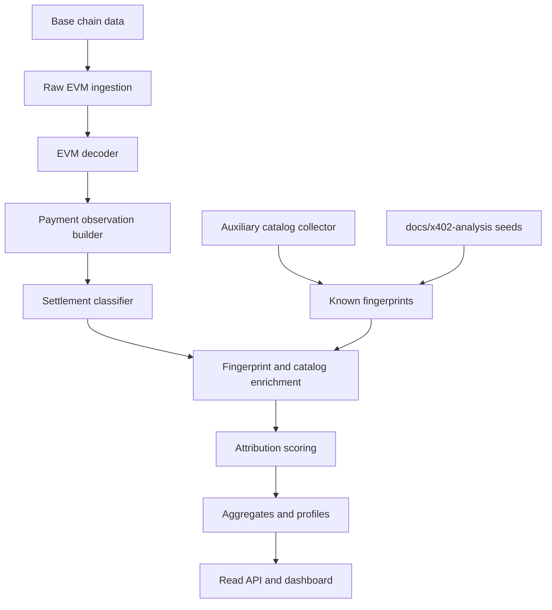
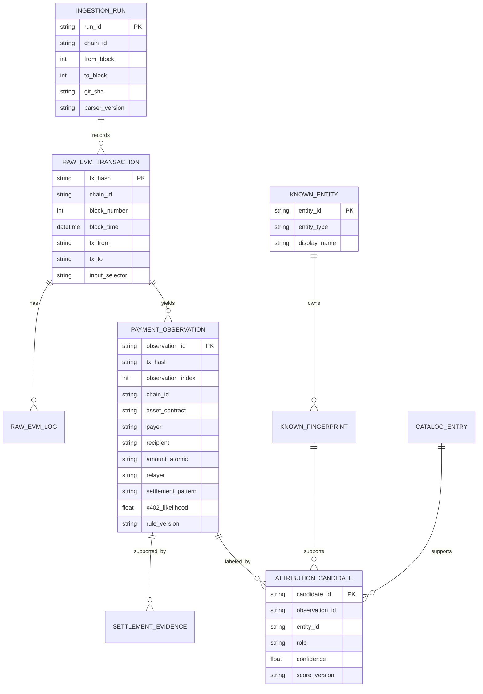
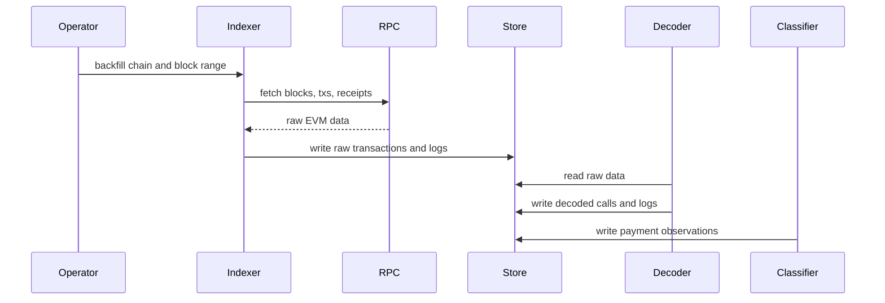

# Flovia 260427 Implementation Spec

## 1. Purpose

This document turns the Flovia 260427 product direction into an implementation plan.

Flovia 260427 is an EVM onchain-first x402 market intelligence system. The source of truth is settlement activity observed onchain. Catalog data is auxiliary. It enriches known recipients, middlemen, providers, and services, but it must not create payment observations by itself.

Core invariant:

```text
Onchain observations are the source of truth.
Catalog and fingerprint data only enrich or label already-observed activity.
Attribution is probabilistic, versioned, and auditable.
```

## 2. Scope

### In scope for MVP

- EVM only
- Base mainnet first
- Base USDC settlement first
- Direct USDC `transferWithAuthorization`
- Multicall3 helper pattern wrapping USDC authorization transfer
- payer, recipient, relayer, amount, nonce, and settlement pattern extraction
- recipient, payer, and relayer clustering
- known fingerprint seed from `docs/x402-analysis/`
- catalog join as enrichment only
- daily metrics and dashboard-ready projections

### Out of scope for MVP

- Solana parsing
- SPL token transfer parsing
- HTTP telemetry
- endpoint-level attribution from request paths
- referrer / source / acquisition analytics
- automatic paid probing as a discovery source
- claiming that every `transferWithAuthorization` is x402

## 3. Architecture overview



The pipeline direction is intentionally one-way:

```text
chain data -> decoded facts -> observations -> enrichment -> candidates -> metrics
```

Catalog data does not drive discovery. It only labels or scores observed payments.

## 4. Component boundaries

### chain-indexer

Fetches blocks, transactions, and receipts. It owns sync cursors, backfill ranges, incremental sync, reorg handling, and raw immutable chain artifacts. It should not classify x402.

### evm-decoder

Decodes transaction targets, selectors, USDC calls, Multicall3 calls, and receipt logs. It extracts `AuthorizationUsed` and `Transfer` events, but does not decide provider, middleman, or facilitator identity.

### payment-observation-builder

Converts decoded EVM facts into normalized `payment_observations`. It identifies payer from authorization / transfer evidence, recipient from transfer evidence, and preserves `tx.from` as relayer candidate.

### settlement-classifier

Classifies settlement mechanics such as Direct USDC and Multicall3 helper. It assigns `x402_likelihood`, `settlement_pattern_confidence`, evidence notes, and rule version. It should not decide provider identity.

### fingerprint-catalog-collector

Collects known catalog data and seed fingerprints. This is where the current catalog collector fits. It emits `known_fingerprints` and `catalog_entries` for enrichment, not canonical payment facts.

### attribution-engine

Joins payment observations to known fingerprints and catalog entries. It emits provider, middleman, facilitator, payee, and relayer candidates with numeric confidence, reasons, evidence refs, and score version.

### aggregator

Builds daily metrics, payer wallet profiles, recipient clusters, relayer clusters, product overlap edges, and middleman summaries.

### dashboard-api

Serves read-only projections and evidence drill-downs. It should display weak candidates as candidates, not facts.

## 5. Data model

Keep raw facts, normalized observations, and mutable attribution separate.



### raw_evm_transactions

Immutable raw tx-level facts:

```text
tx_hash
chain_id
block_number
block_time
tx_from
tx_to
input_selector
input_data_ref
receipt_ref
ingestion_run_id
removed
```

### raw_evm_logs

Immutable raw receipt log facts:

```text
tx_hash
chain_id
block_number
log_index
address
topics
data
removed
```

### payment_observations

Mostly immutable normalized payment facts:

```text
observation_id
tx_hash
chain_id
block_number
block_time
observation_index
tx_from
tx_to
selector
asset_contract
payer
recipient
amount_atomic
authorization_nonce
relayer
settlement_pattern
inner_call_target
inner_call_selector
x402_likelihood
settlement_pattern_confidence
parser_version
rule_version
evidence_ref
```

Do not bake provider or middleman into this table as final truth. Those belong in `attribution_candidates`.

### settlement_evidence

Evidence rows supporting a payment observation:

```text
evidence_id
observation_id
evidence_type
tx_hash
log_index
call_path
selector
topic0
decoded_summary
raw_ref
```

### known_entities

Entities that can be assigned roles:

```text
provider
middleman
facilitator
payee
relayer
catalog_source
resource_host
unknown_cluster
```

### known_fingerprints

Evidence-backed known signals:

Detailed catalog seed format, evidence requirements, confidence buckets, and
conflict handling are specified in
`docs/products/flovia260427/fingerprint-catalog.md`.

```text
entity_id
signal_type
signal_value
chain_id
asset
confidence
source
first_seen_at
last_seen_at
evidence_ref
```

Signal types:

```text
recipient_wallet
relayer_address
settlement_pattern
selector
tx_target
inner_selector
catalog_pay_to
facilitator_url
resource_host
amount_pattern
```

### catalog_entries

Normalized public catalog facts used for enrichment:

```text
catalog_entry_id
source
source_url
fetched_at
resource_url
resource_host
method
network_raw
chain_id_normalized
asset
amount_atomic
pay_to
provider_claim
service_claim
facilitator_claim
raw_ref
response_hash
```

### attribution_candidates

Versioned role assignments:

```text
candidate_id
observation_id
entity_id
role
confidence
confidence_bucket
score_version
reasons
evidence_refs
created_at
```

Roles:

```text
provider_candidate
middleman_candidate
facilitator_candidate
payee
relayer
resource_host_candidate
```

## 6. Detection rules

### Pattern A: Direct USDC

Required evidence:

```text
tx.to == Base USDC
selector == 0xe3ee160e
receipt includes AuthorizationUsed
receipt includes Transfer
decoded payer, recipient, amount, nonce are available
```

Interpretation:

```text
tx.from = relayer candidate
tx.to = token contract
Transfer.from = payer
Transfer.to = recipient
Transfer.value = amount
```

Classification:

```text
settlement_pattern = direct_usdc_transfer_with_authorization
settlement_pattern_confidence = high
x402_likelihood = medium by default
```

`x402_likelihood` can increase when relayer, recipient, amount, or catalog fingerprint matches known x402 activity.

### Pattern B: Multicall3 Helper

Required evidence:

```text
tx.to == 0xca11bde05977b3631167028862be2a173976ca11
selector == 0x82ad56cb
inner call target == Base USDC
inner selector == 0xcf092995
receipt includes AuthorizationUsed
receipt includes Transfer
decoded payer, recipient, amount, nonce are available
```

Interpretation:

```text
tx.from = relayer candidate
tx.to = Multicall3 helper
inner target = token contract
Transfer.from = payer
Transfer.to = recipient
Transfer.value = amount
```

Classification:

```text
settlement_pattern = multicall3_usdc_transfer_with_authorization
settlement_pattern_confidence = high
x402_likelihood = medium by default
```

`0xca11...` alone is not x402-specific. The inner USDC authorization transfer and logs are required.

## 7. Attribution model

Attribution is not a single label. It is a set of candidates by role.

Track these separately:

```text
x402_likelihood
settlement_pattern_confidence
payee_confidence
relayer_confidence
facilitator_candidate_confidence
middleman_candidate_confidence
provider_candidate_confidence
```

Strong signals:

- tx target and selector
- decoded inner call target and selector
- receipt log pattern
- decoded payer, recipient, amount, nonce
- known relayer pool match
- known recipient wallet match

Medium signals:

- catalog payTo match
- amount pattern
- time-window cluster
- repeated recipient grouping
- relayer funding cluster

Weak signals:

- provider name from catalog alone
- resource host from catalog alone
- Base USDC usage alone
- `transferWithAuthorization` alone

Candidate examples:

```text
Direct USDC pattern
+ known Orthogonal recipient wallet
+ known Orthogonal-like relayer
=> middleman_candidate: Orthogonal, confidence medium
```

```text
recipient wallet matches CoinGecko catalog payTo
+ amount matches catalog amount
+ chain and asset match
=> provider_candidate: CoinGecko, confidence weak to medium
```

## 8. Pipeline design

### Historical backfill



Requirements:

- idempotent by chain, block, tx hash, log index
- resumable by cursor
- run manifest saved for every run
- reorg handling marks records as removed rather than deleting immediately

### Incremental sync

```text
poll latest finalized block
fetch new block range
write raw facts
decode and classify
update aggregates
advance cursor
```

Use a finality delay for Base to reduce reorg churn.

### Reprocessing

Reprocessing is required when parser or scoring rules improve:

```text
raw facts remain unchanged
decoded facts can be regenerated with parser_version
payment_observations can be regenerated for rule_version
attribution_candidates can be regenerated for score_version
aggregates can be rebuilt from observations and candidates
```

### Fingerprint refresh

```text
docs/x402-analysis seeds
public catalog collector
manual analyst overrides
=> known_entities, known_fingerprints, catalog_entries
```

Catalog refresh does not create payment observations.

## 9. Catalog collector integration

The existing catalog collector should be treated as a supporting subsystem.

It should produce:

```text
catalog_entries
known_entities
known_fingerprints
raw catalog evidence refs
```

It should not produce:

```text
payment_observations
onchain facts
final provider attribution
```

Recommended changes to make it fit this product:

- preserve conflicting catalog claims instead of deduping them away
- store source fetch URL and response hash
- keep raw payloads as evidence refs, not only inline blobs
- normalize network, asset, amount, and payTo for join
- emit role hints rather than final labels
- keep `resources.json` as a UI projection only

## 10. Storage and artifacts

For an early implementation, JSON or SQLite is acceptable. The boundaries should still mirror the final data model.

Suggested local artifact layout:

```text
data/flovia260427/
  runs/
    <run_id>/manifest.json
    <run_id>/raw-transactions.jsonl
    <run_id>/raw-logs.jsonl
    <run_id>/payment-observations.jsonl
    <run_id>/attribution-candidates.jsonl
  latest/
    payment-observations.json
    known-fingerprints.json
    attribution-candidates.json
    daily-metrics.json
    payer-wallet-profiles.json
    recipient-clusters.json
    relayer-clusters.json
```

Run manifest fields:

```text
run_id
git_sha
command
chain_id
from_block
to_block
rpc_url_label
parser_version
rule_version
score_version
started_at
finished_at
input_artifacts
output_artifacts
```

## 11. Implementation phases

### Phase 0: Fixtures and constants

- Base chain config
- Base USDC address
- Multicall3 address
- ABI fragments
- known selector constants
- fixture tx hashes from `docs/x402-analysis/`
- parser test fixtures

### Phase 1: Direct USDC parser

- raw tx / receipt fetcher
- Direct USDC decoder
- `AuthorizationUsed` and `Transfer` extraction
- `payment_observations` for direct pattern
- tests using known Orthogonal / CoinGecko / CoinStats / OriginDAO txs

### Phase 2: Multicall3 parser

- Multicall3 `aggregate3` decoder
- inner USDC call decoder
- `payment_observations` for helper pattern
- tests using Bluepages / Paysponge / Aimo txs

### Phase 3: Known fingerprints

- seed known relayers
- seed known recipient wallets
- seed known settlement patterns
- seed middleman candidates
- seed provider candidates where evidence exists

### Phase 4: Attribution scoring

- `attribution_candidates`
- confidence scores and reasons
- conflict handling
- score versioning
- explainable drill-down per observation

### Phase 5: Clustering and metrics

- payer wallet profiles
- recipient clusters
- relayer clusters
- product overlap edges
- daily metrics

### Phase 6: Dashboard/API projection

- settlement overview
- recipient intelligence
- payer wallet intelligence
- product overlap
- relayer / facilitator intelligence
- middleman inference

## 12. Validation strategy

Unit tests:

- Direct USDC selector match
- Direct USDC log extraction
- Multicall3 outer decode
- Multicall3 inner call decode
- payer is not `tx.from`
- recipient is not `tx.to`
- multiple observations in one tx if needed
- unknown tx ignored safely

Fixture tests should use known tx hashes from the research docs:

```text
Orthogonal Serper
Orthogonal Olostep
Orthogonal Andi
CoinGecko
CoinStats news
OriginDAO quest board
Bluepages
Paysponge Perplexity
Paysponge WolframAlpha
Aimo search
```

Expected assertions:

- settlement pattern
- payer
- recipient
- amount
- relayer
- tx target
- selector

Integration tests:

- backfill a bounded block window
- produce deterministic observations
- rebuild attribution candidates from same observations
- rebuild daily metrics from same candidates

## 13. Open questions

- Should the first storage target be SQLite or JSONL artifacts?
- Which Base RPC/indexer should be the default for repeatable backfills?
- What finality delay should incremental sync use?
- Should catalog refresh live in the same repo package or remain a separate auxiliary app?
- How much manual analyst override should be allowed in `known_fingerprints`?
- How should conflicting catalog claims be displayed in the dashboard?

## 14. Implementation rule of thumb

If a fact came from chain data, store it as an observation.

If a label came from catalog, docs, or analyst knowledge, store it as a fingerprint or attribution candidate.

If the system is not sure, keep multiple candidates and show confidence rather than collapsing to one answer.
