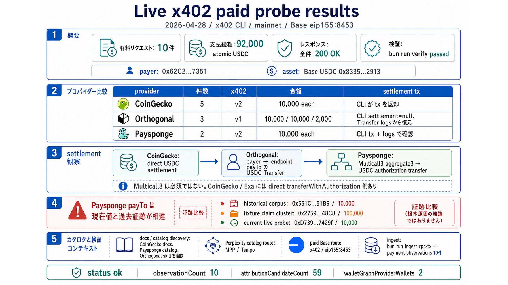

# Live x402 paid probe results



2026-04-28 に `x402` CLI で live paid request を実行した endpoint と onchain settlement の記録。

## Execution context

| field | value |
| --- | --- |
| CLI | `x402` |
| mode | `mainnet` |
| selected network | `base` / `eip155:8453` |
| payer | `0x62C2d106293398961894BCd4908B06a8620B7351` |
| asset | Base USDC `0x833589fCD6eDb6E08f4c7C32D4f71b54bdA02913` |
| total paid requests | 10 |
| total amount | `92000` atomic USDC |
| verification | `bun run verify` passed |

Each paid execution used a per-request `--spend-limit` matching the expected payment amount.

## Paid endpoint summary

| provider | count | response | amount pattern | settlement tx availability |
| --- | ---: | --- | --- | --- |
| CoinGecko | 5 | all `200 OK` | `10000` each | returned by `x402` CLI |
| Orthogonal | 3 | all `200 OK` | Andi/Olostep `10000`, Serper `2000` | recovered from Base USDC `Transfer` logs |
| Paysponge | 2 | all `200 OK` | `10000` each | returned by `x402` CLI and confirmed from logs |

## CoinGecko

All CoinGecko paid requests selected the same Base payment option.

| field | value |
| --- | --- |
| x402 version | 2 |
| network | `eip155:8453` |
| asset | Base USDC `0x833589fCD6eDb6E08f4c7C32D4f71b54bdA02913` |
| amount | `10000` |
| payTo | `0x110cdBba7FE6434Ec4CE3464CC523942ad6Fb784` |

| probe id | method | URL | response | tx hash |
| --- | --- | --- | ---: | --- |
| `coingecko-simple-price` | GET | `https://pro-api.coingecko.com/api/v3/x402/simple/price?ids=bitcoin&vs_currencies=usd` | 200 | `0xe26f587555eeb045f54e842501e1fd0f94bfb674728e559b0306e43b69604f20` |
| `coingecko-token-price` | GET | `https://pro-api.coingecko.com/api/v3/x402/onchain/simple/networks/base/token_price/0x833589fCD6eDb6E08f4c7C32D4f71b54bdA02913` | 200 | `0xbcaa8b960f22b6080a7a6d4515f6784c70e948ade5bb7704fb3ebbf982ec85cf` |
| `coingecko-search-pools` | GET | `https://pro-api.coingecko.com/api/v3/x402/onchain/search/pools?query=pump&network=solana` | 200 | `0xdb9598c40c6e89d1aaeb30a9f344fe197013739acf6dd79f544062436762a960` |
| `coingecko-trending` | GET | `https://pro-api.coingecko.com/api/v3/x402/onchain/networks/base/trending_pools` | 200 | `0xef283dc5c30b9eb72e4f9163c82ee7a4a99f39e0d86af38478d4a0d45ae10121` |
| `coingecko-token-data` | GET | `https://pro-api.coingecko.com/api/v3/x402/onchain/networks/base/tokens/0x833589fCD6eDb6E08f4c7C32D4f71b54bdA02913` | 200 | `0x5bedccfa0801eddb28d880a6ce05f752bfb29ae676059aa544e31f2641d12261` |

CoinGecko live payTo matched the historical local probe value for the tested endpoint family.

## Orthogonal

Orthogonal endpoints returned x402 version 1 challenges. The CLI paid successfully, but its JSON output had `settlement: null`. Settlement tx hashes were recovered by scanning recent Base USDC `Transfer` logs from the payer to each endpoint payTo.

| probe id | method | URL | x402 version | amount | payTo | response | tx hash |
| --- | --- | --- | ---: | ---: | --- | ---: | --- |
| `orth-andi` | GET | `https://x402.orth.sh/andi/v1/search?q=x402` | 1 | `10000` | `0x09CBbB451Ca48ed511c7fc07eD921d539CdE1227` | 200 | `0x16ff114faa1889aabc0818f99fb3f3f111b82384bca8ffd371d1b8310c4b3b8a` |
| `orth-olostep` | POST | `https://x402.orth.sh/olostep/v1/scrapes` | 1 | `10000` | `0x67cD43fcfce8ab2d6477a1f6bf8dFf67aA5E86e1` | 200 | `0xf2b59a9902116afc170a91088189d2773ded70b2601ee4fd35c633c01c968cbc` |
| `orth-serper` | POST | `https://x402.orth.sh/serper/search` | 1 | `2000` | `0x1563CdE0042d17F53b23d91Fd9B73ACE9Da26a09` | 200 | `0xfab930dfdaa071280916f7c66cc07f299fcda0d81a775629be99e9941a03a10a` |

Orthogonal live payTo values matched the historical local probe values for these three endpoints.

## Paysponge

Paysponge endpoints returned x402 version 2 challenges. Both endpoints selected the same payTo.

| field | value |
| --- | --- |
| x402 version | 2 |
| network | `eip155:8453` |
| asset | Base USDC `0x833589fCD6eDb6E08f4c7C32D4f71b54bdA02913` |
| amount | `10000` |
| current live payTo | `0xD73912BA30832328a3db96BeE73ebfaB58b7429f` |

| probe id | method | URL | response | tx hash |
| --- | --- | --- | ---: | --- |
| `paysponge-perplexity-historical` | POST | `https://pplx.x402.paysponge.com/search` | 200 | `0xf87a275c0b99610388bd2f080f042999cc1e1649ed81d1e08d3278f5a739b264` |
| `paysponge-wolfram-historical` | GET | `https://wolframalpha.x402.paysponge.com/v1/result?i=2%2B2` | 200 | `0xe84740b74b2819ccf816b9ea8ba25a724e5310f37969a1541ebcc0fe49fb578a` |

Additional paid request examples for the same Paysponge endpoints were already recorded:

| service | tx hash | relayer |
| --- | --- | --- |
| Perplexity | `0xff2efef85ca9328e71712d8d07d0d6677522d6254d536c645683f0c40f488557` | `0xc6699d2aada6c36dfea5c248dd70f9cb0235cb63` |
| Wolfram Alpha | `0x45a45e03d1be8aefda8c886d1ffa16f57955a9096909057239007daf1f22f35b` | `0xb2bd29925cbbcea7628279c91945ca5b98bf371b` |

The four observed Paysponge settlement txs use Multicall3 `aggregate3`:

| field | value |
| --- | --- |
| top-level target | `0xca11bde05977b3631167028862be2a173976ca11` |
| selector | `0x82ad56cb` |
| status | `0x1` |
| observed log count | 2 |

The decoded Multicall3 call wraps a Base USDC authorization transfer. The observed receipt logs include `AuthorizationUsed` and `Transfer`.

Current observed service-specific relayers:

| service | relayer |
| --- | --- |
| Perplexity | `0xc6699d2aada6c36dfea5c248dd70f9cb0235cb63` |
| Wolfram Alpha | `0xb2bd29925cbbcea7628279c91945ca5b98bf371b` |

The current live Paysponge payTo differs from prior local evidence:

| evidence source | payTo | amount |
| --- | --- | ---: |
| historical normalized probe corpus | `0x551C176D17236ee9cE6f450dC02bd5c2767751B9` | `10000` |
| poc fixture claim cluster | `0x27599d824bbB4F506F985af865d840F61ba848C8` | `100000` |
| current live paid probe | `0xD73912BA30832328a3db96BeE73ebfaB58b7429f` | `10000` |

## Settlement observations

| provider | observed settlement shape |
| --- | --- |
| CoinGecko | direct USDC settlement; CLI returned tx hash |
| Orthogonal | USDC transfer observed from payer to endpoint payTo; CLI did not return settlement object |
| Paysponge | Multicall3 `aggregate3` wrapping Base USDC authorization transfer |

The current paid probes were ingested with `bun run ingest:rpc-tx`. Each tx produced one payment observation.

Additional direct-settlement comparison examples recorded during the same research thread:

| service | tx | method | selector | relayer | recipient | amount |
| --- | --- | --- | --- | --- | --- | ---: |
| CoinGecko | `0xc26c25f66d72f48212e632a51de66f5ed735a9694d5405f96eaa1aebf3cbb7bb` | `direct_transferWithAuthorization` | `0xe3ee160e` | `0xa32ccda98ba7529705a059bd2d213da8de10d101` | `0x110cdBba7FE6434Ec4CE3464CC523942ad6Fb784` | `10000` |
| Exa | `0x196b575769f4712a19e53746ebed430f07bd4bfd26f5ad10861545ad5c74801a` | `direct_transferWithAuthorization` | `0xe3ee160e` | `0x97acce27d5069544480bde0f04d9f47d7422a016` | `0x6d6E695b09861467c7d462f5AAF31cF3540B9192` | `7000` |

Multicall3 is not required for x402/USDC settlement. The recorded CoinGecko and Exa examples settled through direct USDC `transferWithAuthorization` calls.

## Catalog and docs context

The following non-paid discovery endpoints were also checked:

| target | result |
| --- | --- |
| `https://docs.coingecko.com/docs/x402` | CoinGecko x402 docs found |
| `https://docs.coingecko.com/docs/ai-agent-hub/x402` | same CoinGecko x402 endpoint set found |
| `https://catalog.paysponge.com/skill.md` | Paysponge catalog skill found |
| `https://api.catalog.paysponge.com/api/services` | catalog API origin confirmed |
| `https://catalog.paysponge.com/api/services` | returned 404 |
| `https://api.catalog.paysponge.com/api/services/coingecko` | CoinGecko catalog entry found |
| `https://api.catalog.paysponge.com/api/services/perplexity` | Perplexity catalog entry found |
| `https://paysponge.com` | live |
| `https://docs.paysponge.com` | live |
| `https://wallet.paysponge.com/skill.md` | Sponge Wallet skill found |
| `https://paywithlocus.com/skill.md` | Locus skill found |
| `https://paywithlocus.com/llms.txt` | Locus MPP and wrapped API index found |
| `https://www.orthogonal.com/skill.md` | Orthogonal skill found |
| `https://www.orthogonal.com/discover` | static fetch returned minimal discover page |

Current Paysponge catalog discovery for Perplexity returned an MPP/Tempo route:

```text
https://perplexity.mpp.paywithlocus.com
protocol: mpp
network: tempo
```

That route is separate from the paid Base x402 route tested here:

```text
https://pplx.x402.paysponge.com/search
protocol: x402
network: eip155:8453
```

## Verification output

After ingesting the 10 paid txs, repository verification passed:

```json
{
  "status": "ok",
  "observationCount": 10,
  "attributionCandidateCount": 59,
  "walletGraphProviderWallets": 2
}
```
